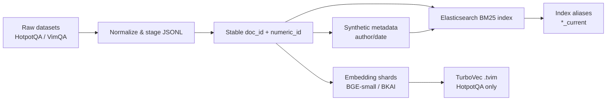
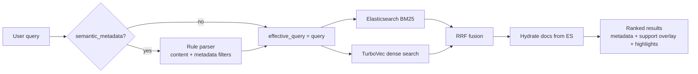

# Report trình bày hệ thống: Full-corpus Retrieval Workspace

Ngày cập nhật: 2026-06-30
Mục tiêu file: thay thế báo cáo tổng hợp cũ bằng bản bám sát yêu cầu trình bày của mentor. File này không phải slide deck cuối cùng, mà là report/kịch bản nội dung để dựng slide, quay demo và chuẩn bị QA.

## 0. Executive Summary

Dự án hiện match khá tốt với yêu cầu mentor ở các phần: định nghĩa bài toán input/output, pipeline ingest/search, benchmark trên 2 dataset, so sánh BM25/dense/hybrid/bridge-aware retrieval, metadata search, paraphrase robustness, ablation multi-hop, TurboVec full-corpus engineering, và demo happy cases. Phần còn thiếu chính là: video demo chưa quay, survey commercial tools cần cô đọng thành 1 slide, biểu đồ latency theo top-k/corpus-size 100/500/1000/10000 chưa có artifact trực tiếp, và phần slide deck cuối cùng chưa được render thành PowerPoint.

Thông điệp chính nên trình bày:

> Hệ thống là một evidence retrieval workspace cho multi-hop QA và semantic metadata search. Trọng tâm là retrieve đúng evidence ở quy mô full corpus, so sánh lexical/dense/hybrid bằng metric phù hợp, rồi làm retrieval có thể giải thích được bằng support overlay, highlight, metadata filters và semantic parser.

Điểm mạnh hiện tại:

- HotpotQA full corpus: 5,233,329 documents, Elasticsearch BM25 index, TurboVec 4-bit dense index, hybrid RRF runtime.
- HotpotQA full test benchmark đã chạy trên 7,405 queries: `tv_bridge_title_entities_rrf` đạt `full_support@10=0.6008`, cao hơn `tv_hybrid=0.5175`.
- VimQA retrieval proxy: 3,623 documents, 9,044 queries, 9,044 qrels, benchmark đủ 9,044 queries.
- Metadata full index đã được cập nhật: `hotpotqa_full_bm25_current -> hotpotqa_full_bm25_metadata_v2`, cả `author`, `created_at`, `modified_at` có đủ trên 5,233,329 docs.
- UI/API dataset-first: HotpotQA và VimQA dùng chung runtime nhưng profile riêng.
- Evaluation có nhiều lớp: full-support recall, paraphrase robustness, ranking diagnostics, metadata narrowing, semantic metadata smoke.

Điểm cần nói rõ để không overclaim:

- HotpotQA đã có full `beir/hotpotqa/test` retrieval benchmark, nhưng đây là retrieval evidence coverage, không phải answer EM/F1 hoặc supporting-fact F1 của hệ QA end-to-end.
- Metadata HotpotQA/VimQA là synthetic, dùng để demo cơ chế metadata-aware retrieval, không phải metadata thật của corpus.
- Semantic metadata parser hiện là rule-based opt-in parser an toàn cho demo, chưa phải natural language parser tổng quát.
- Chưa có latency scaling chart cho các mức 100/500/1000/10000 theo cùng protocol; cần chạy thêm nếu mentor bắt buộc phần này.

## 1. Mapping yêu cầu mentor với trạng thái dự án

| Yêu cầu mentor | Match hiện tại | Bằng chứng trong repo | Gap cần bổ sung |
| --- | --- | --- | --- |
| Slide giới thiệu bài toán, input/output, ví dụ 1p30s | Có thể làm ngay | Dataset-first search, HotpotQA/VimQA profiles, support overlay | Cần chọn 1 ví dụ ngắn và chốt wording slide |
| Survey open-source research và closed-source tools | Có thể viết bằng survey ngoài repo | BEIR/DPR/ColBERT/RAG; Elastic/Pinecone/Azure/Algolia docs | Cần cô đọng còn 1-2 slide, không sa đà lịch sử |
| Pipeline tổng thể search và ingest data, thêm model/icon/config, 2 slide riêng, 3p | Có đủ kiến trúc | `README.md`, `src/api/dataset_profiles.py`, `scripts/es_hotpotqa.py`, TurboVec artifacts | Cần vẽ lại thành hình slide đẹp |
| Slide kỹ thuật, engineering, DB | Có nhiều nội dung | Elasticsearch, TurboVec, Redis, SQLite history, FastAPI, React | Cần gom thành 1 slide engineering decisions |
| Bảng thông tin 2 dataset | Có đủ số liệu | HotpotQA manifest, VimQA benchmark artifacts | Nên ghi rõ VimQA là retrieval proxy |
| Bảng so sánh phương pháp trên 2 dataset | Có đủ cho HotpotQA/VimQA | `tv_hybrid_test_full.json`, `tv_bridge_title_entities_rrf_beam1_terms6_test_full.json`, `bm25_vimqa_full.json`, `dense_bkai_vimqa_full.json` | HotpotQA claim ở mức retrieval, không claim QA answer score |
| Metrics accuracy và latency/resources | Có accuracy/latency; resources có TurboVec index size | TurboVec index size 1,067,602,206 bytes; latency p50/p95/qps | Resource table cần thêm ES store size nếu muốn chính xác hơn |
| Biểu đồ latency 100/500/1000/10000 | Chưa có đúng artifact | Có latency theo methods và full/query-count runs | Cần chạy benchmark scaling riêng hoặc đổi thành chart hiện có |
| Video demo không lồng tiếng | Chưa quay | UI/runtime có sẵn | Cần quay các case đã liệt kê bên dưới |
| Test case result = 0 và bật real system | Có thể chạy | Search/filter API đã có | Cần tạo query/filter chắc chắn trả 0 và record video |
| Slide đóng góp chính | Có đủ | Full-corpus, TurboVec, metadata, dataset runtime, diagnostics | Cần chọn 4-5 đóng góp, tránh liệt kê dài |
| Phụ lục công thức metrics | Có thể viết ngay | Metrics runner dùng precision/recall/MRR/nDCG/full-support | Có trong report này |
| Bảng ablation: paraphrase, multi-hop, TurboVec | Có đủ | paraphrase summary, bridge_rrf, tv_full/tv_filtered | Cần dựng thành 1-2 slide ablation |
| References | Có thể làm ngay | Papers + official docs | Đưa link cuối report |
| QA | Có thể chuẩn bị | PRESENTATION.md có Q&A cũ | Bổ sung câu hỏi mentor likely ask |

## 2. Slide plan đề xuất

Tổng flow nên đi theo bài toán -> survey -> kiến trúc -> kỹ thuật -> dataset -> kết quả -> demo -> contributions -> appendix, không đi theo sprint.

### Slide 1. Problem: Evidence Retrieval cho câu hỏi phức tạp

Thời lượng: 45 giây.

Nội dung chính:

- Input: câu hỏi/truy vấn tự nhiên, có thể chứa metadata intent.
- Output: top-k documents/contexts làm evidence.
- Với HotpotQA, output đúng không chỉ là 1 document liên quan, mà là đủ bộ supporting documents.
- Với metadata search, output cần vừa đúng nội dung vừa thỏa constraints như author/date.

Ví dụ nên dùng:

```text
Input: Daniel Márcio Fernandes plays for a club founded in which year?
Output: ranked evidence documents, support hits, score, metadata/debug fields.
```

Điểm nói:

> Em tập trung vào retrieval layer, không claim answer generation end-to-end. Nếu retrieval thiếu một support document trong multi-hop QA, downstream reasoning vẫn fail, nên metric chính phải đo khả năng retrieve đủ evidence.

### Slide 2. Input/Output examples

Thời lượng: 45 giây.

| Loại input | Ví dụ | Output mong muốn |
| --- | --- | --- |
| Query gốc HotpotQA | `Scarface Nation was a book written by...` | Top-k Wikipedia docs, support overlay |
| Paraphrase | Query được diễn đạt lại | Dense/hybrid vẫn tìm được evidence |
| Metadata search | `find documents about anarchism by Nguyen An before 01/31/2024` | `effective_query=anarchism`, filter author/date, ranked docs |
| No-result case | `author=Nguyen An`, date ngoài range | 0 hit hoặc warning rõ ràng |

### Slide 3. Survey: open-source/research branch

Thời lượng: 1 phút.

| Nhánh | Đại diện | Ưu điểm | Nhược điểm | Insight rút ra cho dự án |
| --- | --- | --- | --- | --- |
| Lexical retrieval | BM25/Elasticsearch/Lucene | Nhanh, mạnh với entity/exact match, filter tốt | Yếu khi paraphrase làm mất lexical overlap | Cần làm baseline và document store |
| Dense dual-encoder | DPR, SentenceTransformers/BGE | Semantic matching tốt, robust hơn với paraphrase | Cần embedding/index, có thể tốn RAM/latency | Cần dense path nhưng phải nén/tối ưu |
| Late interaction/reranking | ColBERT, cross-encoder reranker | Quality cao hơn, fine-grained matching | Chi phí compute cao, vận hành phức tạp | Chỉ thêm reranker khi diagnostics chứng minh cần |
| Benchmarks | BEIR | Đánh giá OOD/đa domain tốt | Benchmark không thay thế product demo | Dùng HotpotQA/VimQA rõ ràng, không overclaim |
| Vector libraries/DB | FAISS, Milvus, Qdrant, Vespa | Nhiều lựa chọn self-host/hybrid | Cần tự ghép metadata, BM25, ops | Dự án chọn ES + TurboVec để cân bằng local scale |

Insight nên highlight:

> Research systems thường mạnh về quality/benchmark nhưng đòi hỏi nhiều compute và tuning. Demo này chọn hướng hybrid thực dụng: BM25 cho precision/filter/hydration, TurboVec dense cho semantic recall nén, RRF để fuse hai ranking khác thang điểm.

### Slide 4. Survey: commercial/closed-source or managed tools

Thời lượng: 1 phút.

| Nhánh tool | Ví dụ | Điểm mạnh | Điểm yếu với bài toán này |
| --- | --- | --- | --- |
| Enterprise search | Algolia NeuralSearch, Elastic Cloud | Tích hợp nhanh, search UX tốt, ops nhẹ | Ít kiểm soát experiment/research metrics, chi phí/lock-in |
| Managed vector DB | Pinecone | Vector/hybrid workflow nhanh, managed scaling | BM25/document hydration/multi-hop evaluation phải tự ghép |
| Cloud AI search | Azure AI Search | Hybrid keyword+vector+RRF, filter/facet enterprise-ready | Phụ thuộc cloud, khó trình bày engineering ownership local |
| Full managed RAG stack | Nhiều vendor RAG tools | Demo nhanh end-to-end | Ít minh bạch về candidate generation/ranking failure |

Insight nên nói:

> Commercial tools tối ưu time-to-market; research/open-source tối ưu kiểm soát và đo lường. Dự án này nằm ở giữa: dùng building blocks open-source/local để tự đo quality, latency, metadata behavior và failure buckets.

### Slide 5. Pipeline ingest data

Thời lượng: 1.5 phút.



Thông tin cần ghi trên slide:

- HotpotQA: 5,233,329 docs, 105 shards, `numeric_id` 0..5,233,328.
- Metadata full index đã có đủ 5,233,329 docs.
- TurboVec artifact: `hotpotqa_bge_small_4bit.tvim`, 1,067,602,206 bytes, BGE-small dim 384, 4-bit.
- VimQA: 3,623 docs, 9,044 queries/qrels, BKAI 768-dim dense_vector in Elasticsearch.

### Slide 6. Pipeline search/runtime

Thời lượng: 1.5 phút.



Engineering point:

- Elasticsearch: BM25, filters, document hydration, metadata store.
- TurboVec: compressed dense retrieval for HotpotQA full corpus.
- FastAPI: dataset profiles, search execution plan, caching/history.
- React dashboard: Search, Queries, Benchmarks, Metadata, History, Status.
- Redis: response cache.
- SQLite: search history.

### Slide 7. Kỹ thuật và engineering decisions

| Decision | Vì sao chọn | Trade-off |
| --- | --- | --- |
| Dataset profiles | Một runtime phục vụ HotpotQA/VimQA | Cần maintain config rõ ràng |
| ES BM25 + document store | Fast lexical, metadata filters, hydrate docs | Dense vector full-scale trong ES có thể nặng |
| TurboVec dense index | Full-corpus dense search nén, local-friendly | Cần bridge `numeric_id`, cần host embedding service |
| RRF fusion | Không cần calibrate score BM25 và dense | Thêm latency vì chạy nhiều retriever |
| Rule-based semantic parser | An toàn cho demo, dễ giải thích | Không hiểu mọi câu tự nhiên |
| Synthetic metadata | Demo metadata-aware retrieval được trên public corpus | Không claim real meeting metadata |

### Slide 8. Dataset table

| Dataset | Vai trò | Docs | Queries | Qrels/support | Ngôn ngữ | Metric chính | Ghi chú |
| --- | --- | ---: | ---: | ---: | --- | --- | --- |
| HotpotQA full corpus | Multi-hop evidence retrieval | 5,233,329 | 7,405 full test queries | HotpotQA support docs | English | `full_support_recall@10` | Full test đã chạy; claim retrieval evidence coverage, không claim answer score |
| VimQA retrieval proxy | Vietnamese retrieval ablation | 3,623 | 9,044 | 9,044 | Vietnamese | `recall@10`, `MRR@10`, `nDCG@10` | QA-derived retrieval proxy, không phải native BEIR benchmark |

### Slide 9. Method comparison: HotpotQA full test accuracy vs latency

Protocol: full `beir/hotpotqa/test`, 7,405 queries, top-k=10, local runtime.

| Method | Nhóm | Precision@10 | Recall@10 | MRR@10 | nDCG@10 | Full-support@10 | p50 ms | p95 ms | QPS |
| --- | --- | ---: | ---: | ---: | ---: | ---: | ---: | ---: | ---: |
| `tv_hybrid` | Hybrid RRF | 0.1461 | 0.7305 | 0.8413 | 0.7001 | 0.5175 | 403.46 | 760.92 | 1.91 |
| `tv_bridge_title_entities_rrf` | Bridge-aware | 0.1517 | 0.7585 | 0.8251 | 0.7120 | 0.6008 | 881.91 | 1598.34 | 0.73 |
| Delta | Bridge - hybrid | +0.0056 | +0.0280 | -0.0162 | +0.0119 | +0.0833 | +478.45 | +837.42 | -1.18 |

Paper-style highlight:

- Best full-test quality: `tv_bridge_title_entities_rrf` với full-support@10 = 0.6008.
- Practical interactive default: `tv_hybrid`, vì p95 thấp hơn nhiều và MRR cao hơn.
- Core trade-off: bridge-aware retrieval tăng complete evidence coverage +8.33 điểm tuyệt đối, đổi lại p95 tăng từ 0.76s lên 1.60s.
- Claim an toàn: đây là retrieval benchmark, không phải answer generation score.

### Slide 10. Method comparison: VimQA accuracy vs latency

Protocol: full 9,044 queries, top-k=10.

| Method | Nhóm | Precision@10 | Recall@10 | MRR@10 | nDCG@10 | p50 ms | p95 ms | QPS |
| --- | --- | ---: | ---: | ---: | ---: | ---: | ---: | ---: |
| `es_bm25` | Lexical | 0.0963 | 0.9627 | 0.8606 | 0.8859 | 57.94 | 84.42 | 16.39 |
| `es_dense` BKAI | Dense | 0.0872 | 0.8716 | 0.7272 | 0.7625 | 83.73 | 115.04 | 10.60 |
| `es_hybrid` | Hybrid RRF | 0.0964 | 0.9644 | 0.8277 | 0.8609 | 176.05 | 206.30 | 1.24 |

Insight:

> VimQA cho thấy không thể assume dense/hybrid luôn thắng. Với corpus nhỏ, query-context lexical overlap cao, BM25 có MRR/nDCG và latency tốt nhất, nên default VimQA là `es_bm25`.

### Slide 11. Resource/latency focus: TurboVec

| Artifact / runtime | Giá trị | Ý nghĩa |
| --- | ---: | --- |
| HotpotQA docs | 5,233,329 | Full corpus retrieval, không còn nano-only |
| Embedding model | BAAI/bge-small-en-v1.5 | 384-dim query/doc embeddings |
| TurboVec bit width | 4-bit | Nén dense vectors để phù hợp local demo |
| TurboVec index size | 1,067,602,206 bytes (~1.0 GB) | Dense index compact cho 5.23M docs |
| Build time | ~2.72 phút | Theo Harness evidence US-S3-007 |
| `tv_dense` p95 | 868.00 ms | Dense semantic retrieval latency |
| `tv_hybrid` full-test p95 | 760.92 ms | Interactive default cân bằng quality/latency |
| `tv_bridge_title_entities_rrf` full-test p95 | 1598.34 ms | Quality-first bridge path, chậm hơn nhưng coverage tốt hơn |

Gap cần nói nếu mentor hỏi chart 100/500/1000/10000:

> Repo hiện chưa có benchmark latency scaling theo các mức 100/500/1000/10000 trong cùng protocol. Có thể dựng chart hiện tại theo method latency, nhưng nếu cần đúng yêu cầu thì phải chạy thêm benchmark scaling riêng.

Đề xuất benchmark bổ sung:

```powershell
python -m src.evaluation.benchmark_es --dataset beir/hotpotqa/dev --index hotpotqa_full_bm25_current --methods es_bm25,tv_dense,tv_hybrid --top-k 10 --max-queries 100 --output evaluation/results/hotpotqa_full/scaling_100.json
python -m src.evaluation.benchmark_es --dataset beir/hotpotqa/dev --index hotpotqa_full_bm25_current --methods es_bm25,tv_dense,tv_hybrid --top-k 10 --max-queries 500 --output evaluation/results/hotpotqa_full/scaling_500.json
python -m src.evaluation.benchmark_es --dataset beir/hotpotqa/dev --index hotpotqa_full_bm25_current --methods es_bm25,tv_dense,tv_hybrid --top-k 10 --max-queries 1000 --output evaluation/results/hotpotqa_full/scaling_1000.json
```

Với 10,000 queries, HotpotQA dev/test hiện không có 10,000 query trong project artifact; cần đổi ý nghĩa thành corpus-size scaling hoặc dùng dataset khác.

### Slide 12. Metadata search và semantic parser

Metadata artifact:

| Field | Value |
| --- | ---: |
| Docs with metadata | 5,233,329 |
| Metadata fields | `author`, `created_at`, `modified_at` |
| Synthetic authors | 128 |
| Created date range | 2024-01-01 to 2025-12-30 |
| Modified date range | 2024-01-01 to 2026-02-12 |

Metadata narrowing:

| Scenario | Filter | Matching docs | Narrowing |
| --- | --- | ---: | ---: |
| Content-only | none | 5,233,329 | 0.0000% |
| Author | `author=Nguyen An` | 40,886 | 99.2187% |
| Created date | January 2024 | 222,239 | 95.7534% |
| Modified date | 2024-01-10..2024-01-20 | 60,589 | 98.8422% |
| Author + date | `Nguyen An` + January 2024 | 1,793 | 99.9657% |

Semantic metadata example:

```text
Input: find documents about anarchism by Nguyen An before 01/31/2024
Parsed content: anarchism
Parsed filters: author=Nguyen An, created_at_to=2024-01-31
```

Design choice:

- Parser chỉ bật khi `semantic_metadata=true`.
- Rule-based parser an toàn cho demo.
- Không append metadata vào embeddings.
- UI show parsed chips để người xem biết parser hiểu gì.

### Slide 13. Ablation: paraphrase robustness

| Method | Original full-support@10 | Mild | Strong | Lexical strong | Delta lexical strong |
| --- | ---: | ---: | ---: | ---: | ---: |
| `es_bm25` | 0.365 | 0.365 | 0.375 | 0.340 | -0.025 |
| `tv_dense` | 0.515 | 0.515 | 0.515 | 0.495 | -0.020 |
| `tv_hybrid` | 0.535 | 0.515 | 0.515 | 0.480 | -0.055 |
| `tv_filtered_hybrid` | 0.430 | 0.435 | 0.440 | 0.395 | -0.035 |

Insight:

- Dense path ổn định hơn khi lexical overlap bị phá.
- Hybrid tốt nhất trên original nhưng robustness gap lớn hơn dense-only.
- Đây là lý do cần tiếp tục tuning hybrid/fusion hoặc reranking dựa trên diagnostics.

### Slide 14. Ablation: multi-hop bridge retrieval

| Method / split | Full-support@10 | Recall@10 | nDCG@10 | p95 ms | Kết luận |
| --- | ---: | ---: | ---: | ---: | --- |
| `tv_hybrid`, dev pilot | 0.5450 | 0.7500 | 0.7291 | 1146.58 | Strong simple baseline |
| `tv_two_hop_bridge_rrf`, dev pilot | 0.5600 | 0.7450 | 0.6999 | 2773.59 | Naive bridge only gives small gain and worse ranking |
| `tv_bridge_title_entities_rrf`, dev tuned | 0.6200 | 0.7775 | 0.7382 | 1224.99 | Best tuned bridge setting |
| `tv_hybrid`, full test | 0.5175 | 0.7305 | 0.7001 | 760.92 | Interactive default |
| `tv_bridge_title_entities_rrf`, full test | 0.6008 | 0.7585 | 0.7120 | 1598.34 | Quality-first benchmark method |

Insight:

> Bridge retrieval chỉ hiệu quả khi second-hop query lấy đúng signal từ title/entity của first-hop evidence. Bản naive bridge tăng ít và chậm; bản title/entity tuned tăng full-support rõ ràng và gain giữ được trên full test. Vì latency vẫn cao hơn, report nên trình bày bridge method là quality-first path, còn `tv_hybrid` là runtime default.

### Slide 15. Ranking diagnostics và reranker decision

| Method | Full support@10 | Any support@10 | Missing candidate | Partial support | Success |
| --- | ---: | ---: | ---: | ---: | ---: |
| `es_bm25` | 0.365 | 0.840 | 32 | 95 | 73 |
| `tv_dense` | 0.515 | 0.930 | 14 | 83 | 103 |
| `tv_hybrid` | 0.545 | 0.955 | 9 | 82 | 109 |
| `tv_filtered_hybrid` | 0.455 | 0.905 | 19 | 90 | 91 |

Interpretation:

- Diagnostics hiện dựa trên top-10 artifacts, nên `candidate_ranked_low=0` không đủ để kết luận reranker vô ích.
- Cần top-50/top-100 candidate runs để biết relevant docs có trong pool nhưng bị xếp thấp hay không.
- Đây là slide thể hiện engineering discipline: không thêm reranker chỉ vì intuition.

### Slide 16. Video demo plan

Video không lồng tiếng, người thuyết trình nói live trên video. Nên quay 3-4 phút, nhưng trên slide chỉ chiếu các đoạn highlight.

| Demo case | Dataset | Input | Expected behavior | Trạng thái |
| --- | --- | --- | --- | --- |
| Happy case HotpotQA | HotpotQA | Preset query có support docs | Top results, Gold Support Found x/y, highlight terms | Có thể quay ngay |
| Paraphrase case | HotpotQA | Một query paraphrase từ artifact | Dense/hybrid vẫn trả evidence liên quan | Cần chọn query cụ thể |
| Metadata filter | HotpotQA | `author=Nguyen An`, date range | Corpus narrowing, results có metadata chips | Có thể quay ngay |
| Semantic metadata | HotpotQA | `find documents about anarchism by Nguyen An before 01/31/2024` | Parsed chips + effective query + filtered results | Có thể quay ngay |
| Vietnamese query | VimQA | Preset VimQA query | BM25 default, evidence context | Có thể quay ngay |
| No result | HotpotQA | Date outside synthetic range hoặc impossible author/date combo | 0 results / clear state | Cần tạo test case và verify trước khi quay |

No-result test gợi ý:

```text
Query: anarchism
Filter: author=Nguyen An, created_at_from=2030-01-01, created_at_to=2030-01-31
Expected: 0 hits vì synthetic created_at max là 2025-12-30.
```

Trước khi quay video cần bật real system:

```powershell
python scripts/embedding_server.py --host 0.0.0.0 --port 8010
./start.sh
```

Hoặc nếu dùng compose/API network hiện tại, cần đảm bảo:

- Elasticsearch healthy.
- `hotpotqa_full_bm25_current` trỏ `hotpotqa_full_bm25_metadata_v2`.
- Embedding service sẵn sàng cho TurboVec queries.
- Frontend mở được dashboard.

### Slide 17. Đóng góp chính

Nên chọn 5 đóng góp, không liệt kê quá dài:

1. **Full-corpus retrieval runtime**: scale HotpotQA từ demo nhỏ lên 5.23M docs với BM25 + TurboVec dense + hybrid RRF.
2. **Compressed dense retrieval engineering**: build TurboVec 4-bit index ~1GB cho 5.23M docs, bridge dense hits về Elasticsearch qua `numeric_id`.
3. **Evaluation beyond recall**: dùng `full_support_recall@10`, paraphrase robustness, ranking diagnostics và latency/QPS để đánh giá đúng multi-hop retrieval.
4. **Dataset-first workspace**: một API/UI chạy HotpotQA và VimQA với profile riêng, benchmark riêng, default method riêng.
5. **Explainable metadata-aware search**: synthetic metadata filters, semantic metadata parser opt-in, parsed chips, highlight và support overlay.

### Slide 18. What is missing / future work

| Gap | Vì sao quan trọng | Next action |
| --- | --- | --- |
| Full-test diagnostics cho bridge method | Giải thích sâu hơn vì sao success/partial/missing thay đổi | Sinh diagnostics full test cho success, partial support, missing support |
| Latency scaling 100/500/1000/10000 | Mentor muốn chart latency scaling | Chạy benchmark scaling hoặc định nghĩa lại thành corpus-size scaling |
| Real meeting metadata | Hiện metadata là synthetic proxy | Định nghĩa schema speaker/time/participants/action items |
| Reranker decision | Chưa biết failure do candidate hay ranking | Generate top-50/top-100 diagnostics |
| Video demo | Mentor yêu cầu happy/no-result cases | Quay video không lồng tiếng với checklist trên |
| Ingest hardening | Full metadata ingest từng timeout batch 1000 | Backlog #11: retry/backoff/safe batch/defaults |

## 3. Appendix: công thức metrics

### Precision@k

```text
Precision@k = (# relevant docs in top-k) / k
```

Ý nghĩa: trong top-k trả về có bao nhiêu phần là relevant. Với VimQA mỗi query thường có 1 gold context, precision@10 sẽ thấp hơn recall vì mẫu số cố định là 10.

### Recall@k

```text
Recall@k = (# relevant docs in top-k) / (# relevant docs total)
```

Ý nghĩa: hệ thống tìm được bao nhiêu phần relevant documents trong top-k.

### MRR@k

```text
MRR@k = average over queries of 1 / rank(first relevant doc)
```

Nếu không có relevant doc trong top-k, contribution là 0. MRR đo khả năng đẩy evidence đầu tiên lên sớm.

### nDCG@k

```text
DCG@k = sum_i (rel_i / log2(i + 1))
nDCG@k = DCG@k / ideal_DCG@k
```

Ý nghĩa: đo ranking quality có xét vị trí; relevant doc ở rank cao được thưởng nhiều hơn.

### Full-support Recall@k

```text
full_support_recall@k = (# queries có toàn bộ support docs trong top-k) / (# queries)
```

Metric này quan trọng nhất cho HotpotQA multi-hop. Nếu query cần 2 support docs mà top-k chỉ có 1 doc, query đó chưa đạt full-support.

### Latency p50 / p95 / p99

```text
p50 = median latency
p95 = 95th percentile latency
p99 = 99th percentile latency
```

p95/p99 quan trọng cho demo vì người dùng cảm nhận tail latency rõ hơn trung bình.

### QPS

```text
QPS = number_of_queries / total_elapsed_seconds
```

Trong project này QPS là local benchmark evidence, không phải production SLA.

## 4. QA chuẩn bị trước

### Vì sao dùng TurboVec thay vì chỉ Elasticsearch dense_vector?

HotpotQA full corpus có 5.23M docs. Elasticsearch rất tốt cho BM25, filter và document hydration, nhưng dense retrieval full-scale trên local hardware dễ nặng. TurboVec giúp dense index nén 4-bit, giữ dense retrieval trong khoảng artifact ~1GB, rồi hydrate kết quả từ Elasticsearch qua `numeric_id`.

### Vì sao report nhấn mạnh bridge-aware nhưng runtime vẫn nên giữ `tv_hybrid`?

Trên full test, bridge-aware retrieval có chất lượng tốt nhất: `full_support@10=0.6008`, cao hơn `tv_hybrid=0.5175`. Nhưng p95 latency tăng từ 760.92 ms lên 1598.34 ms và MRR giảm nhẹ từ 0.8413 xuống 0.8251. Vì vậy report/slide nên gọi bridge method là quality-first benchmark path, còn `tv_hybrid` là interactive default hợp lý hơn khi demo trực tiếp.

### Vì sao default VimQA lại là BM25?

VimQA retrieval proxy có lexical overlap cao giữa question/context và corpus nhỏ hơn. BM25 đạt Recall@10 0.9627, MRR@10 0.8606, nDCG@10 0.8859 với p95 84.42ms. Hybrid nhỉnh recall@10 0.9644 nhưng MRR/nDCG thấp hơn và p95 206.30ms, nên BM25 là default hợp lý.

### Metadata có thật không?

Không. Metadata hiện tại là synthetic để demo cơ chế metadata-aware retrieval: author/date filters, semantic parser và result metadata display. Không claim đây là metadata thật của HotpotQA/VimQA.

### Vì sao chưa dùng LLM parser cho semantic metadata?

Demo cần an toàn và có thể giải thích. Rule-based parser chỉ parse khi user bật `semantic_metadata=true` và câu có pattern rõ. LLM parser có thể mạnh hơn nhưng cần guardrail/evaluation để tránh hallucinated filters.

### Vì sao chưa thêm reranker?

Reranker chỉ giúp nếu relevant docs đã vào candidate pool nhưng bị xếp thấp. Diagnostics hiện mới ở top-10, chưa có top-50/top-100 để chứng minh lỗi nằm ở ranking. Vì vậy chưa nên thêm reranker như một default path.

### Có thể claim paper-comparable HotpotQA không?

Có thể claim ở mức BEIR-style retrieval metric cho full `beir/hotpotqa/test`, ví dụ `nDCG@10=0.7120` và `full_support@10=0.6008` cho bridge-aware retrieval. Không được claim hệ thống đã beat HotpotQA QA papers, vì các paper đó thường báo answer EM/F1, supporting-fact F1 hoặc joint metrics, còn benchmark này chỉ đo retrieval evidence coverage.

## 5. References

Research/open-source:

- BEIR: A Heterogeneous Benchmark for Zero-shot Evaluation of Information Retrieval Models. https://arxiv.org/abs/2104.08663
- Dense Passage Retrieval for Open-Domain Question Answering. https://arxiv.org/abs/2004.04906
- ColBERT: Efficient and Effective Passage Search via Contextualized Late Interaction over BERT. https://arxiv.org/abs/2004.12832
- Retrieval-Augmented Generation for Knowledge-Intensive NLP Tasks. https://arxiv.org/abs/2005.11401
- FAISS: efficient similarity search and clustering of dense vectors. https://github.com/facebookresearch/faiss
- Milvus hybrid search documentation. https://milvus.io/docs/hybrid_search_with_milvus.md
- Qdrant hybrid queries documentation. https://qdrant.tech/documentation/search/hybrid-queries/
- Vespa hybrid text search tutorial. https://docs.vespa.ai/en/learn/tutorials/hybrid-search.html

Commercial/managed tools:

- Elastic hybrid search overview. https://www.elastic.co/what-is/hybrid-search
- Pinecone hybrid search documentation. https://docs.pinecone.io/guides/search/hybrid-search
- Azure AI Search hybrid search overview. https://learn.microsoft.com/en-us/azure/search/hybrid-search-overview
- Algolia NeuralSearch documentation. https://www.algolia.com/doc/guides/ai-relevance/neuralsearch/get-started

Internal project evidence:

- `README.md`
- `PRESENTATION.md`
- `docs/sprint3/sprint3-report.md`
- `docs/sprint4/sprint4-report.md`
- `docs/sprint4/metadata-demo-report.md`
- `docs/sprint4/paraphrase-robustness-report.md`
- `docs/sprint5/ranking-diagnostics-report.md`
- `docs/sprint5/semantic-metadata-search-report.md`
- `docs/sprint5/hotpotqa-test-benchmark-paper-comparison.md`
- `evaluation/results/hotpotqa_full/test_full/tv_hybrid_test_full.json`
- `evaluation/results/hotpotqa_full/test_full/tv_bridge_title_entities_rrf_beam1_terms6_test_full.json`
- `evaluation/results/hotpotqa_full/tv_full_200.json`
- `evaluation/results/hotpotqa_full/tv_filtered_full_200.json`
- `evaluation/results/hotpotqa_full/paraphrase_final/summary_with_lexical_strong.json`
- `evaluation/results/hotpotqa_full/bridge_rrf/bridge_rrf_pilot_200.json`
- `evaluation/results/hotpotqa_full/metadata/scenario_summary.json`
- `evaluation/results/hotpotqa_full/ranking_diagnostics/top10_diagnostics.json`
- `evaluation/results/vimqa/bm25_vimqa_full.json`
- `evaluation/results/vimqa/dense_bkai_vimqa_full.json`
- `artifacts/hotpotqa_full/staging/manifest.json`
- `artifacts/hotpotqa_full/metadata/manifest.json`
