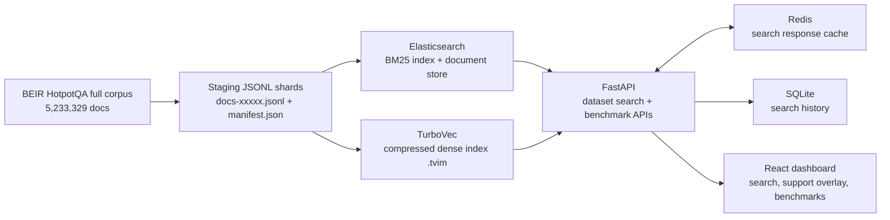
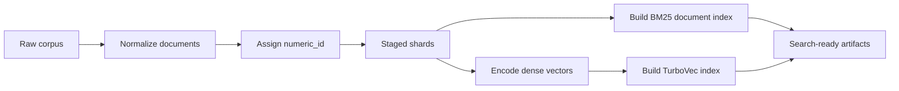
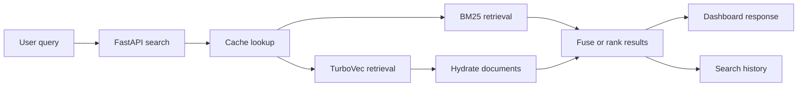
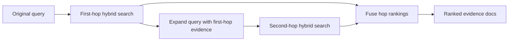
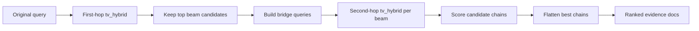

# Kiến Trúc Hiện Tại

Cập nhật lần cuối: 2026-06-28

Tài liệu này mô tả kiến trúc hiện tại của `vdt-meeting-search`. Hệ thống đang
là demo truy xuất full-corpus HotpotQA: Elasticsearch phụ trách BM25 và hydrate
document, TurboVec phụ trách dense retrieval trên corpus 5.23M documents, Redis
cache response tìm kiếm lặp lại, và React dashboard chạy với queries/qrels của
`beir/hotpotqa/dev`.

## 1. Tổng Quan Hệ Thống

```text
HotpotQA full corpus + beir/hotpotqa/dev queries
  -> staging JSONL shards
  -> Elasticsearch BM25 index + TurboVec dense index
  -> retrieval methods / support overlay
  -> benchmark metrics / FastAPI API
  -> React dashboard
```

### Sơ Đồ Kiến Trúc



### Pipeline Ingest Và Xây Dựng Index Offline



### Pipeline Retrieval Runtime Online



### Các Pipeline Multi-hop Retrieval

#### Mở Rộng Query Lặp



#### Tìm Kiếm Bridge-RRF Kiểu Beam



| Lớp | Thành phần | Vai trò |
|---|---|---|
| Dataset / ETL | `scripts/stage_hotpotqa.py`, `src/data/staging.py` | Load HotpotQA từ `ir_datasets`, chuẩn hóa document, ghi staging JSONL |
| Ingest | `scripts/es_hotpotqa.py`, `scripts/embed_hotpotqa.py`, `scripts/build_turbovec.py` | Tạo Elasticsearch BM25 index, build embedding shards, build TurboVec index, validate document count |
| Retrieval | `src/retrieval/elasticsearch_retriever.py`, `src/retrieval/turbovec_retriever.py` | BM25, TurboVec dense, hybrid RRF, filtered hybrid, iterative expansion, two-hop Bridge-RRF |
| Evaluation | `src/evaluation/benchmark_es.py`, `src/evaluation/metrics.py` | Chạy benchmark, ghi TREC runs, tính metrics |
| API | `src/api/main.py`, `src/api/dataset_profiles.py` | FastAPI endpoints cho health, dataset profiles, stats, queries, benchmark, history, search |
| Cache | Redis | Cache các `/search` response lặp lại theo query/method/top-k/index |
| History | SQLite | Lưu search history và top returned documents |
| Frontend | `frontend/` | React/Vite dashboard gọi FastAPI API |
| Embedding service | `scripts/embedding_server.py` | Local `/embed` HTTP service để API container không cần PyTorch |

## 2. Bố Cục Repository

```text
src/
  api/                  FastAPI app và history store
  core/                 Runtime settings từ environment variables
  data/                 HotpotQA loading, staging, ingest EDA helpers
  evaluation/           Benchmark runner, metrics, paraphrase comparison
  retrieval/            Elasticsearch retriever và retrieval primitives

scripts/
  stage_hotpotqa.py     Stage HotpotQA docs từ ir_datasets
  es_hotpotqa.py        Create/index/ingest/validate/search Elasticsearch
  embedding_server.py   Local embedding HTTP service
  paraphrase_queries.py Query paraphrase stress-test generator

frontend/               React/Vite dashboard
docs/baseline/          Baseline reports và reproduce commands
docs/data/vimqa/        VimQA JSON files, chưa tích hợp native
evaluation/results/     Benchmark JSON outputs và query TSVs
evaluation/runs/        TREC run files
artifacts/*/staging     JSONL staging shards
artifacts/*/progress    Ingest done markers
```

## 3. Pipeline Dữ Liệu

HotpotQA documents được load từ full corpus `beir/hotpotqa`. API query examples
và gold support labels mặc định dùng `beir/hotpotqa/dev`; Docker dùng fallback
file `evaluation/results/hotpotqa_full_dev_queries.tsv` vì API image cố ý không
cài `ir_datasets`.

`src/data/staging.py` chuẩn hóa mỗi document thành staging shape này:

```json
{
  "doc_id": "...",
  "title": "...",
  "text": "...",
  "url": "...",
  "content": "title + text",
  "embedding_text": "title + text"
}
```

`content` được dùng cho lexical retrieval trong Elasticsearch. `embedding_text`
chỉ được dùng lúc ingest để encode vectors; nó không được lưu trong
Elasticsearch source document.

Staging ghi JSONL shards như:

```text
artifacts/hotpotqa_full/staging/docs-00000.jsonl
artifacts/hotpotqa_full/staging/manifest.json
```

## 4. Indexing Trong Elasticsearch

`scripts/es_hotpotqa.py` là CLI quản lý vòng đời Elasticsearch index. Nó hỗ trợ
tạo BM25/document-store index, ingest staged documents, validate counts, và chạy
search probes. Dense full-corpus retrieval được build thành TurboVec artifact
riêng, không lưu trong Elasticsearch cho active runtime.

Schema Elasticsearch active full-corpus lưu document text và `numeric_id` join
key:

| Trường | Kiểu | Vai trò |
|---|---|---|
| `numeric_id` | `long` | Numeric join key ổn định cho TurboVec hydration và filtered hybrid allowlists |
| `doc_id` | `keyword` | Stable document id, cũng được dùng làm ES `_id` |
| `title` | `text` | Title để search/display |
| `text` | `text` | Body để search/display |
| `url` | `keyword` | Metadata |
| `content` | `text` | Lexical search field |

Legacy dense-vector helpers vẫn còn cho các thí nghiệm cũ, nhưng active
full-corpus dense path là TurboVec với vectors `BAAI/bge-small-en-v1.5` 384
dimensions.

Ingest flow:

```text
staging JSONL
  -> read batch
  -> helpers.bulk() document source into Elasticsearch
  -> write progress marker docs-xxxxx.done
  -> refresh index after ingest completes
```

Progress markers trong `artifacts/.../progress` cho phép resume ingest job nếu
bị dừng giữa chừng.

## 5. Lớp Retrieval

Retrieval logic nằm trong `src/retrieval/elasticsearch_retriever.py` và
`src/retrieval/turbovec_retriever.py`.

| Method | Tên nội bộ | Hành vi |
|---|---|---|
| `es_bm25` | `bm25` | Elasticsearch `multi_match` trên `title^2` và `content` |
| `tv_dense` | `tv_dense` | Encode query qua host embedding service rồi search mounted TurboVec index |
| `tv_hybrid` | `tv_hybrid` | Lấy BM25 candidates và TurboVec dense candidates, sau đó fuse bằng RRF |
| `tv_filtered_hybrid` | `tv_filtered_hybrid` | Dùng BM25 candidates làm allowlist cho TurboVec dense search, sau đó fuse results |

Trong Docker, query embeddings được tạo bởi host HTTP embedding endpoint cấu hình
qua `EMBEDDING_SERVICE_URL`. API container không cài PyTorch hoặc
SentenceTransformers.

## 6. Lớp Benchmark

`src/evaluation/benchmark_es.py` là benchmark runner chính. Hiện tại nó load một
`ir_datasets` dataset trước, rồi load queries/qrels từ dataset hoặc các TSV file
tùy chọn.

CLI inputs quan trọng:

```text
--dataset          ir_datasets id, mặc định beir/hotpotqa/dev
--index            Elasticsearch index hoặc alias
--methods          danh sách method name, phân tách bằng dấu phẩy
--top-k
--candidate-k
--num-candidates
--rrf-k
--first-hop-k
--second-hop-k
--context-chars
--query-file       TSV tùy chọn cho paraphrase/custom queries
--qrels-file       TSV tùy chọn cho custom qrels
```

Outputs được ghi vào `evaluation/results/*.json` và
`evaluation/runs/**/*.trec`.

Metrics được tính trong `src/evaluation/metrics.py`: `precision@k`, `recall@k`,
`mrr@k`, `ndcg@k`, `full_support_recall@k`, latency p50/p95/p99, và QPS.
Dashboard hiển thị benchmark full-corpus dev 200-query hiện tại như project
progress và giữ legacy nano benchmarks ở phía dưới; nếu muốn claim so sánh
paper-comparable thì cần dùng full `beir/hotpotqa/test` split.

`full_support_recall@k` quan trọng với HotpotQA vì nhiều query cần đủ tất cả
supporting documents, không chỉ một relevant hit.

## 7. Lớp API

FastAPI app nằm trong `src/api/main.py`.

| Endpoint | Method | Vai trò |
|---|---|---|
| `/health` | GET | Kiểm tra health |
| `/datasets` | GET | Khám phá dataset profiles cho HotpotQA và VimQA |
| `/datasets/{dataset_id}/stats` | GET | Runtime config theo dataset |
| `/datasets/{dataset_id}/queries` | GET | Query examples và gold docs theo dataset |
| `/datasets/{dataset_id}/benchmarks` | GET | Benchmark dashboard payload theo dataset |
| `/datasets/{dataset_id}/search` | POST | Retrieval search theo dataset |
| `/stats` | GET | Runtime config: backend, index, dataset, model, cache, history path |
| `/queries` | GET | Query examples và support docs từ `ir_datasets` hoặc TSV fallback |
| `/benchmark` | GET | Benchmark dashboard payload gồm current full-corpus progress và legacy nano history |
| `/search` | POST | Chạy BM25/TurboVec retrieval và trả support coverage metadata |
| `/history` | GET | Liệt kê search history |
| `/history/{id}` | GET | Trả về một search history entry |
| `/history` | DELETE | Xóa search history |

Request body của search:

```json
{
  "query_id": "...",
  "query": "...",
  "method": "tv_hybrid",
  "top_k": 10
}
```

Khi `REDIS_URL` được set, `/search` responses được cache theo
`index + query_id + query + method + top_k`. Nếu Redis không sẵn sàng, API
fallback sang retrieval trực tiếp. `/search` responses gồm `support` summary và
per-result `is_support` flag khi có qrels.

Dataset-scoped search cache keys gồm
`dataset_id + index + model + query_id + query + method + top_k + metadata_filters`,
nên HotpotQA và VimQA queries không collide trong Redis. Các legacy endpoints
`/stats`, `/queries`, `/benchmark`, và `/search` delegate sang `hotpotqa` profile
và vẫn compatible trong quá trình frontend migration.

### Hồ Sơ Dataset

API xem datasets như runtime profiles. `src/api/dataset_profiles.py` khai báo
`hotpotqa` và `vimqa` profiles với index aliases, methods, default method,
language, dense backend, embedding model, query/qrels files, benchmark files,
readiness, metadata support, và primary metric.

HotpotQA giữ TurboVec methods: `es_bm25`, `tv_dense`, `tv_hybrid`, và
`tv_filtered_hybrid`. VimQA dùng Elasticsearch BM25/dense/hybrid trên BKAI dense
index và mặc định `es_bm25`. UI vẫn là read-only inspection surface cho query;
Indexes và Metadata views hiển thị profile/runtime information mà không quản lý
indexes hoặc metadata schemas.

`src/api/history.py` lưu search history trong SQLite. Path mặc định là
`data/query_history.sqlite3`; trong Docker Compose nó được backed bởi
`history_data` volume.

## 8. Lớp Frontend

Frontend là React/Vite app trong `frontend/`.

| View | Component | Vai trò |
|---|---|---|
| Status | `StatusView` | Hiển thị backend/runtime configuration |
| Search | `SearchView` | Chạy query theo method/top-k |
| Queries | `QueriesView` | Hiển thị query examples và support docs |
| Benchmark | `BenchmarkView` | Hiển thị benchmark metrics |
| Indexes | `IndexesView` | Hiển thị active dataset index/profile artifacts |
| Metadata | `MetadataView` | Hiển thị metadata filter support theo dataset |
| History | `HistoryView` | Xem search history và chạy lại query |

API client là `frontend/src/lib/api.ts`. Default API base URL là `/api`, khớp
với Docker/Vite proxy setup. Frontend load `GET /datasets` khi startup, lưu
`activeDatasetId`, và route Search, Queries, Benchmarks, Status, Indexes,
Metadata, và History run-again actions qua active dataset profile.

## 9. Stack Phát Triển Docker

`docker-compose.yml` định nghĩa bốn services:

| Service | Host port | Vai trò |
|---|---:|---|
| `elasticsearch` | `9200` | Elasticsearch 8.15.1, single node, tắt security |
| `redis` | internal | Search response cache |
| `api` | `8001 -> 8000` | FastAPI retrieval API |
| `frontend` | `3001` | Vite React dashboard |

Embedding model mặc định không chạy trong API container. API gọi host service
tại `http://host.docker.internal:8010/embed`, được start bằng:

```bash
python scripts/embedding_server.py --host 0.0.0.0 --port 8010
```

## 10. Cấu Hình

Runtime settings nằm trong `src/core/config.py`.

| Biến môi trường | Mặc định | Vai trò |
|---|---|---|
| `DATASET_ID` | `beir/hotpotqa/dev` | Full HotpotQA split dùng cho API query examples và support labels |
| `ELASTICSEARCH_URL` | `http://localhost:9200` | Elasticsearch endpoint |
| `ELASTICSEARCH_INDEX` | `hotpotqa_docs_current` locally, `hotpotqa_full_bm25_current` in Docker | Search index hoặc alias |
| `ELASTICSEARCH_NUM_CANDIDATES` | `1000` | Số candidate mặc định cho dense kNN |
| `EMBEDDING_MODEL` | `BAAI/bge-small-en-v1.5` | SentenceTransformer model |
| `EMBEDDING_SERVICE_URL` | empty locally, `http://host.docker.internal:8010/embed` in Docker | Remote embedding endpoint khi được cấu hình |
| `REDIS_URL` | empty | Redis cache URL |
| `SEARCH_CACHE_TTL_SECONDS` | `300` | Search cache TTL |
| `HISTORY_DB_PATH` | `data/query_history.sqlite3` | SQLite history path |
| `TURBOVEC_INDEX_PATH` | `artifacts/hotpotqa_full/turbovec/hotpotqa_bge_small_4bit.tvim` | Mounted TurboVec dense index |
| `DEFAULT_SEARCH_METHOD` | `tv_hybrid` | Search method mặc định của dashboard/API |

## 11. Ranh Giới Dataset

### HotpotQA

HotpotQA là default dataset profile. Documents đến từ full `beir/hotpotqa`
corpus; API examples và support labels dùng `beir/hotpotqa/dev` hoặc checked-in
fallback `evaluation/results/hotpotqa_full_dev_queries.tsv`. HotpotQA search
dùng `hotpotqa_full_bm25_current` cho BM25 và full TurboVec `.tvim` artifact cho
dense/hybrid retrieval.

### VimQA

VimQA hiện có first-class runtime profile dựa trên Sprint 4 artifacts:

```text
evaluation/results/vimqa/vimqa_queries.tsv
evaluation/results/vimqa/vimqa_qrels.tsv
evaluation/results/vimqa/bm25_vimqa_full.json
evaluation/results/vimqa/dense_bkai_vimqa_full.json
```

Schema quan sát được:

```json
{
  "question": "...",
  "context": "...",
  "answer": "..."
}
```

VimQA được expose qua `/datasets/vimqa/...`. Nó vẫn là single-context QA
retrieval proxy, nên benchmark UI nhấn mạnh `recall@10`, `mrr@10`, và `ndcg@10`
thay vì HotpotQA full-support metrics. Metadata filters được hiển thị là
unsupported cho VimQA trong Sprint 4.

## 12. Giới Hạn Hiện Biết

1. Benchmark runner vẫn phụ thuộc `ir_datasets` cho standard HotpotQA runs.
2. VimQA được implement như retrieval proxy trên prepared TSV/index/benchmark
   artifacts, chưa phải generic dataset adapter.
3. Metadata filters chưa support cho VimQA trong Sprint 4.
4. Embedding model mặc định của HotpotQA là English BGE small; VimQA dùng BKAI dense
   Elasticsearch index thay vì TurboVec.
5. Lần load TurboVec đầu tiên sau API reload có thể chậm hơn warm searches vì
   full `.tvim` artifact được mở on demand.

## 13. Hướng Đề Xuất Sau Dataset Profiles

Dataset profiles hiện đã isolate HotpotQA và VimQA ở API/UI runtime boundary.
Bước cleanup sau có thể đưa prepared artifacts vào sau dataset adapter layer:

```text
RetrievalDataset interface
  -> HotpotQADataset: ir_datasets source
  -> VimQADataset: local JSON source
```

Mỗi adapter nên expose cùng một contract: `docs_iter()`, `queries(max_queries)`,
`qrels(query_ids)`, `slug()`, và `metadata()`.

Artifacts cũng nên được tách theo dataset:

```text
artifacts/hotpotqa_full/...
artifacts/vimqa/test/...
evaluation/results/hotpotqa/...
evaluation/results/vimqa/...
evaluation/runs/hotpotqa/...
evaluation/runs/vimqa/...
```

Elasticsearch indexes và aliases nên tiếp tục tách riêng:

```text
hotpotqa_full_bm25_v1      -> hotpotqa_full_bm25_current
vimqa_all_bm25_current     -> VimQA lexical profile
vimqa_all_dense_bkai_current -> VimQA dense profile
```

Bước kiến trúc tiếp theo là làm benchmark/staging adapters rõ ràng như runtime
profiles, không phải tách API hoặc UI thành services riêng.
