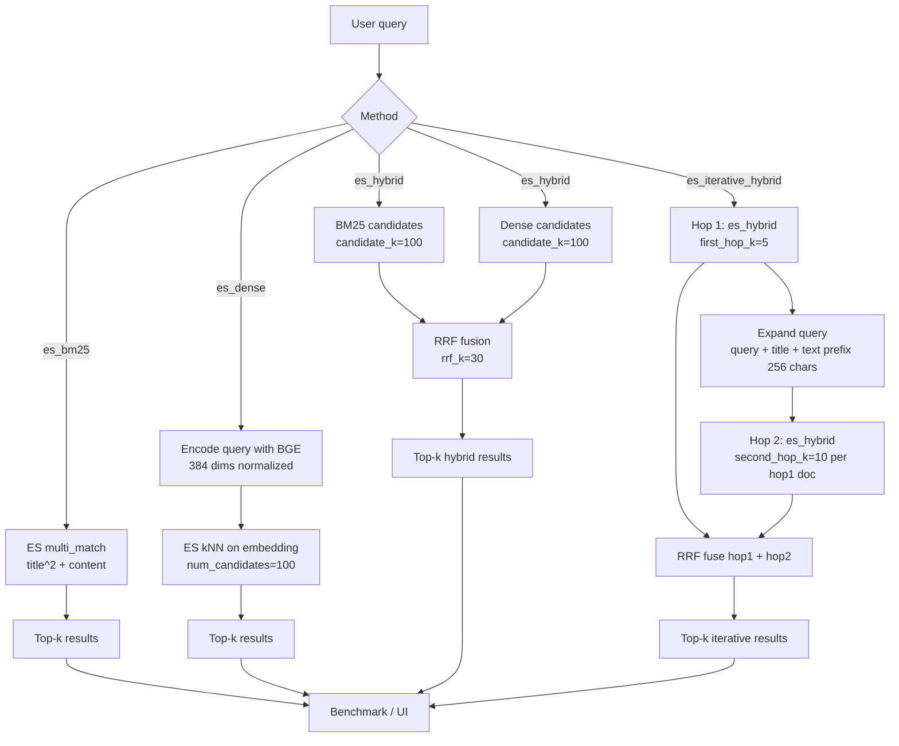

# Technical Report - Elasticsearch Baseline cho HotpotQA

Ngày cập nhật: 2026-06-09

## 1. Tóm tắt

Baseline active hiện tại là **Elasticsearch-only** cho bài toán Hybrid Information Retrieval trên HotpotQA. Các baseline local cũ đã được xoá khỏi code path và artifact kết quả active.

Mục tiêu của baseline là có một hệ thống đúng bài toán, chạy lại được, đo bằng metrics chuẩn và có thể mở rộng từ nano corpus lên full corpus.

| Thành phần | Trạng thái |
|---|---|
| Backend retrieval | Elasticsearch 8.15.1 |
| Dataset benchmark | `nano-beir/hotpotqa` |
| Corpus benchmark | 5,090 docs |
| Queries benchmark | 50 |
| Qrels | 100 |
| Full corpus `beir/hotpotqa` | Chưa ingest/index 5,233,329 docs |

## 2. Pipeline

```text
ir_datasets
  -> EDA/preflight
  -> staging JSONL shards
  -> encode embedding_text bằng BGE small
  -> bulk ingest Elasticsearch
  -> validate index count
  -> BM25 / dense / hybrid / iterative hybrid search trong ES
  -> benchmark qrels
  -> JSON metrics + TREC run files
```

Elasticsearch là backend chung cho sparse retrieval, dense vector retrieval, hybrid fusion và iterative multi-hop baseline. Một HotpotQA document map thành một Elasticsearch document và một embedding vector.

### 2.1 Processing Pipeline

```mermaid
flowchart LR
    A[ir_datasets\nnano-beir/hotpotqa] --> B[EDA / preflight\ncount docs, queries, qrels]
    B --> C[Normalize document\ndoc_id, title, text, url]
    C --> D[Build content\ntitle + text]
    D --> E[Staging JSONL shards\ndocs_per_file=2000 on nano]
    E --> F[Load BGE model\nBAAI/bge-small-en-v1.5]
    F --> G[Encode embedding_text\nnormalize_embeddings=True]
    G --> H[Bulk ingest ES\nbatch_size=64 on nano]
    H --> I[Elasticsearch index\ntext fields + dense_vector 384]
    I --> J[Validate count\nexpected 5090]
```



### 2.2 Retrieval Pipeline



## 3. Pipeline Configuration

| Nhóm | Cấu hình |
|---|---|
| Chunking | Không chunk |
| Granularity | 1 HotpotQA doc = 1 ES doc = 1 vector |
| `content` | `title + text` |
| `embedding_text` | `content`, chỉ dùng để encode |
| Embedding model | `BAAI/bge-small-en-v1.5` |
| Dimension | 384 |
| Normalize embeddings | Có, `normalize_embeddings=True` |
| Vector field | `embedding` |
| Vector similarity | `cosine` |
| Index settings | 1 shard, 0 replicas, `refresh_interval=-1` lúc ingest |
| Staging default | `docs_per_file=50000` |
| Nano staging | `docs_per_file=2000` |
| Ingest batch default | 128 |
| Nano ingest command | `--batch-size 64` |

ES source lưu các field: `doc_id`, `title`, `text`, `url`, `content`, `embedding`. Field `embedding_text` chỉ nằm trong staging JSONL, không lưu vào ES source.

## 4. Search Methods

| Method | Cách search | File chính |
|---|---|---|
| `es_bm25` | Elasticsearch `multi_match` trên `title^2`, `content` | `src/retrieval/elasticsearch_retriever.py` |
| `es_dense` | Elasticsearch kNN trên field `embedding` | `src/retrieval/elasticsearch_retriever.py` |
| `es_hybrid` | `es_bm25` candidates + `es_dense` candidates + Python RRF | `src/retrieval/elasticsearch_retriever.py` |
| `es_iterative_hybrid` | Hop 1 dùng `es_hybrid`; hop 2 expand query từ top evidence; RRF fuse toàn bộ hops | `src/retrieval/elasticsearch_retriever.py` |

### ES Iterative Hybrid

```text
Hop 1:
  Chạy es_hybrid bằng câu hỏi gốc, lấy first_hop_k documents.

Hop 2:
  Với mỗi document hop 1:
    expanded_query = question + title + first context_chars của text
    chạy lại es_hybrid để lấy second_hop_k documents.

Fusion:
  RRF fuse ranking hop 1 và toàn bộ ranking hop 2, trả top-k cuối.
```

Phương pháp này là baseline multi-hop explicit. Nó không dùng LLM và không train model; mục tiêu là đo được tác động của query expansion theo evidence hop 1.

## 5. Benchmark Configuration

Benchmark hiện tại chạy trên đủ 5,090 docs và 50 queries của `nano-beir/hotpotqa`.

| Tham số | Giá trị |
|---|---:|
| `top_k` | 10 |
| `candidate_k` | 100 |
| `num_candidates` | 100 |
| `rrf_k` | 30 |
| `first_hop_k` | 5 |
| `second_hop_k` | 10 |
| `context_chars` | 256 |

Command:

```bash
python -m src.evaluation.benchmark_es --dataset nano-beir/hotpotqa --index hotpotqa_nano_current --methods es_bm25,es_dense,es_hybrid,es_iterative_hybrid --top-k 10 --candidate-k 100 --num-candidates 100 --rrf-k 30 --first-hop-k 5 --second-hop-k 10 --context-chars 256 --output evaluation/results/es_nano_iterative.json --run-dir evaluation/runs/iterative
```

## 6. Metrics

Metrics đang dùng: `precision@k`, `recall@k`, `mrr@k`, `ndcg@k`, `full_support_recall@k`, latency p50/p95/p99 và QPS.

`full_support_recall@k` là metric quan trọng cho HotpotQA vì một query thường cần đủ hai supporting documents. Nếu top-k chỉ chứa một support doc và thiếu doc còn lại thì chưa đủ evidence để answer.

## 7. Kết quả

Artifact chính: `evaluation/results/es_nano_iterative.json`.

| Method | Precision@10 | Recall@10 | MRR@10 | nDCG@10 | Full-support Recall@10 | p50 latency | p95 latency | QPS |
|---|---:|---:|---:|---:|---:|---:|---:|---:|
| `es_bm25` | 0.176 | 0.88 | 0.9072 | 0.8188 | 0.76 | 68.0733 ms | 126.3880 ms | 10.6676 |
| `es_dense` | 0.172 | 0.86 | 0.8872 | 0.8191 | 0.74 | 82.3391 ms | 127.4890 ms | 0.9256 |
| `es_hybrid` | **0.182** | **0.91** | **0.9253** | **0.8631** | **0.82** | 142.0170 ms | 182.1056 ms | 6.8969 |
| `es_iterative_hybrid` | 0.180 | 0.90 | 0.9033 | 0.8341 | **0.82** | 1119.7100 ms | 1593.4272 ms | 0.8408 |

## 8. Đánh giá

`es_hybrid` là method tốt nhất hiện tại theo quality/latency trade-off. Nó đạt Recall@10 0.91, nDCG@10 0.8631 và full-support recall@10 0.82 với p50 latency khoảng 142 ms.

`es_iterative_hybrid` đã đưa multi-hop retrieval explicit vào Elasticsearch path, nhưng chưa vượt `es_hybrid`: full-support recall bằng 0.82, trong khi Recall/MRR/nDCG thấp hơn và p50 latency cao hơn nhiều. Hiện method này phù hợp để debug evidence chain và làm nền cho query expansion tốt hơn.

`es_bm25` là baseline nhanh và mạnh cho HotpotQA vì entity overlap cao. `es_dense` có vai trò bổ sung semantic signal, nhưng dense-only chưa phải lựa chọn tốt nhất trên nano benchmark.

### 8.1 Baseline nano đã tốt chưa?

Trên tập `nano-beir/hotpotqa`, kết quả hiện tại là **tốt cho một baseline phase 1**. Lý do:

1. `es_hybrid` vượt `es_bm25` ở Recall@10, MRR@10, nDCG@10 và full-support recall@10.
2. `full_support_recall@10 = 0.82` nghĩa là 82% queries retrieve đủ toàn bộ supporting docs trong top 10, phù hợp mục tiêu multi-hop evidence retrieval.
3. `es_bm25` vẫn rất mạnh, cho thấy pipeline lexical trên ES hoạt động đúng với đặc tính HotpotQA entity-heavy.
4. `es_iterative_hybrid` đã có explicit two-hop workflow, dù chưa cải thiện quality so với hybrid single-shot.

Tuy nhiên, không nên diễn giải kết quả này là hệ thống đã mạnh trên bài toán full-scale. Nano corpus chỉ có 5,090 docs, ít nhiễu hơn full corpus 5.23M docs. Nhiều query trong HotpotQA nano chứa entity hoặc phrase gần như trùng với supporting documents, nên BM25/hybrid có thể đạt kết quả rất cao. Benchmark thật cần chạy trên `beir/hotpotqa/dev` với full index trước khi kết luận về năng lực production hoặc research quality.

### 8.2 Điểm đặc biệt của kiến trúc

Phần lớn implementation là các thành phần IR cơ bản, nhưng có vài quyết định kiến trúc đáng lưu ý:

| Điểm | Ý nghĩa |
|---|---|
| Elasticsearch-only backend | Sparse BM25, dense vector search, hybrid candidates và API demo đều đi qua một backend, tránh tách store phức tạp. |
| One-doc-one-vector | Dễ validate count, dễ debug qrels theo doc_id, nhưng chưa tối ưu nếu full corpus có documents dài cần passage-level retrieval. |
| Staging JSONL + `.done` markers | Tách ETL khỏi ingest, có thể resume khi encode/bulk ingest bị dừng. Đây là điểm quan trọng khi lên full corpus. |
| `embedding_text` không index vào ES | Giữ staging text dùng cho encode, còn ES source chỉ lưu fields cần search/display. |
| RRF fusion thay vì cộng score | Tránh phải calibrate BM25 score và cosine/kNN score về cùng thang đo. |
| `full_support_recall@k` | Metric này gắn trực tiếp với multi-hop HotpotQA; nếu thiếu nó thì Recall@k thông thường dễ đánh giá quá lạc quan. |
| ES iterative hybrid | Đã có explicit evidence-chain retrieval path, nhưng hiện còn heuristic và latency cao. |

Nói ngắn gọn: kiến trúc không phải một thuật toán mới, nhưng là một baseline engineering tương đối sạch: persistent index, count validation, shared sparse+dense backend, benchmark reproducible, và metric phù hợp multi-hop. Điểm cần cải thiện không nằm ở việc thêm nhiều abstraction, mà ở scale full corpus, passage/chunk strategy, query expansion/reranking và latency instrumentation.

## 9. Hạn chế và next steps

1. Chưa có full corpus index 5,233,329 docs.
2. Dense model mới là BGE small baseline, chưa fine-tune theo HotpotQA.
3. Tuning mới là coarse grid trên nano, chưa có validation split lớn.
4. ES iterative query expansion còn đơn giản và latency cao.
5. Cần tách latency query embedding và ES search để phân tích outlier dense latency.

Thứ tự tiếp theo:

1. Stage và ingest full `beir/hotpotqa`.
2. Validate count 5,233,329.
3. Benchmark `beir/hotpotqa/dev` trên full index.
4. Tune `es_iterative_hybrid`: title-only, entity-aware expansion, selected sentence expansion.
5. Sau full ES baseline, mới thêm reranker hoặc learned multi-hop retriever.

## 10. Nguồn tham khảo

| Nguồn | Dùng để biện minh cho |
|---|---|
| HotpotQA | Chọn dataset multi-hop và metric theo đủ supporting docs |
| BEIR | Format corpus/query/qrels và retrieval metrics |
| BM25 and Beyond | Chọn BM25 làm sparse lexical baseline |
| BGE model card | Chọn embedding model 384 chiều cho ES dense vector |
| Reciprocal Rank Fusion | Fusion BM25 và dense ranking không cần score calibration |
| GoldEn Retriever / MDR / Baleen / IRCoT | Hướng nâng cấp multi-hop retrieval |
