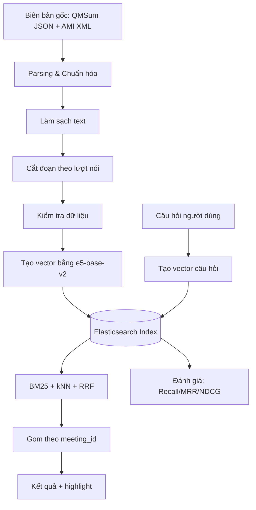
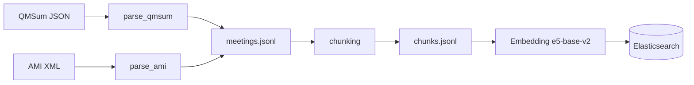
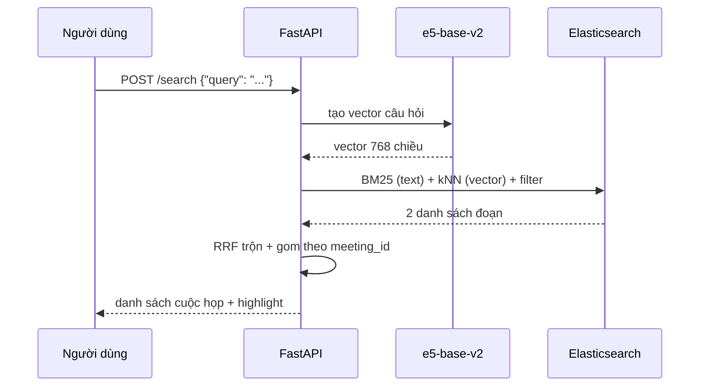

# Giải thích thiết kế hệ thống — Semantic Search cho Biên bản cuộc họp

> Tài liệu này giải thích **toàn bộ cách hệ thống hoạt động** và **vì sao** chúng tôi chọn từng giải pháp, viết cho người **chưa rành kỹ thuật**. Mỗi phần khó đều có ví dụ minh họa cụ thể.

> **Trạng thái đồng bộ 03/06/2026:** Tài liệu này đã được đối chiếu với codebase hiện tại ở mức thiết kế chính: self-host `intfloat/e5-base-v2` 768-dim, embedding tách riêng cho nội dung/metadata, FastAPI search + ingest/update/delete, demo UI static, evaluation script/matrix, và test suite. Những số liệu benchmark/latency vẫn cần chạy lại trên Elasticsearch sống trước khi chốt báo cáo.

---

# 1. Tổng quan mục tiêu

## Bài toán đang giải quyết vấn đề gì?

Một tổ chức có **rất nhiều biên bản cuộc họp**. Khi cần tìm lại một cuộc họp, người ta thường chỉ tìm được nếu nhớ **đúng từ khóa**. Nhưng thực tế người dùng hay nhớ theo **ý nghĩa**, không nhớ chính xác chữ:

- "Cuộc họp bàn về **thiết kế điều khiển từ xa**" — nhưng trong biên bản có thể ghi là "remote control layout", "nút bấm", "giao diện"...
- "Cuộc họp có **anh A tham gia**, nói về **ngân sách**"

Tìm kiếm bằng từ khóa thuần (keyword) sẽ **trượt** những trường hợp này, vì máy chỉ so khớp chữ giống hệt nhau, không hiểu nghĩa.

**Hệ thống này giải quyết điều đó:** cho phép gõ câu hỏi bằng **ngôn ngữ tự nhiên** (như nói chuyện) và tìm ra đúng biên bản theo **ngữ nghĩa**, kết hợp cả lọc theo thông tin ngữ cảnh (người tham gia, nguồn, thời gian).

## Người dùng cuối là ai?

Nhân viên, thư ký, quản lý — những người cần **tra cứu lại nội dung cuộc họp** mà không nhớ chính xác từ ngữ đã dùng trong biên bản.

## Kết quả mong muốn là gì?

Người dùng gõ một câu hỏi → hệ thống trả về **danh sách biên bản phù hợp**, mỗi biên bản kèm:
- Tiêu đề, thời gian, người tham gia
- **Đoạn nội dung liên quan được bôi đậm (highlight)** để giải thích "vì sao biên bản này được chọn"

## Vì sao cần xây dựng pipeline (quy trình xử lý) này?

Vì dữ liệu thô (biên bản gốc) **không thể tìm kiếm thông minh ngay được**. Nó cần đi qua nhiều bước: làm sạch → cắt nhỏ → chuyển thành dạng máy hiểu nghĩa (vector) → đưa vào công cụ tìm kiếm. Mỗi bước là một mắt xích; thiếu một bước thì kết quả tìm kiếm sẽ sai hoặc kém.

## Ví dụ đơn giản cho người không chuyên

> Hãy tưởng tượng một **thư viện khổng lồ**. Tìm kiếm từ khóa giống như tìm sách theo **đúng tên sách**. Còn hệ thống này giống như một **thủ thư giỏi**: bạn chỉ cần mô tả "tôi cần cuốn sách nói về tiết kiệm tiền cho người trẻ", thủ thư hiểu ý và mang đúng sách ra, dù tên sách không hề có chữ "tiết kiệm".

---

# 2. Tổng quan pipeline xử lý

```text
Biên bản gốc (QMSum, AMI)
→ Phân tích & chuẩn hóa (Parsing & Normalization)
→ Làm sạch (Cleaning)
→ Cắt đoạn (Chunking)
→ Kiểm tra dữ liệu (Validation)
→ Tạo vector ngữ nghĩa (Embedding)
→ Đưa vào Elasticsearch (Indexing)
→ Tìm kiếm lai (Hybrid Search: BM25 + vector + RRF)
→ Gom kết quả về mức cuộc họp (Meeting-level Aggregation)
→ Trả kết quả + highlight (Output)
→ Đánh giá (Evaluation)
```

Sơ đồ tổng quát:



Giải thích từng bước:

### Bước: Parsing & Chuẩn hóa
- **Làm gì:** Đọc 2 định dạng dữ liệu rất khác nhau (QMSum dạng JSON, AMI dạng XML) và đưa về **một khuôn mẫu chung**.
- **Vì sao cần:** Nếu mỗi nguồn một định dạng, các bước sau phải viết code riêng cho từng nguồn → rối và dễ lỗi.
- **Bỏ đi thì sao:** Không thể xử lý chung; mỗi lần thêm nguồn mới phải sửa toàn bộ hệ thống.
- **Đầu vào:** File gốc QMSum/AMI. **Đầu ra:** `meetings.jsonl` (mỗi dòng 1 cuộc họp theo khuôn chung).

### Bước: Làm sạch
- **Làm gì:** Gộp khoảng trắng thừa, bỏ lượt nói rỗng. **Giữ nguyên** tên người, chữ hoa/thường, mốc thời gian.
- **Vì sao cần:** Text bẩn làm nhiễu cả tìm kiếm từ khóa lẫn vector.
- **Bỏ đi thì sao:** Kết quả nhiễu, khó highlight chính xác.

### Bước: Cắt đoạn (Chunking)
- **Làm gì:** Cắt cuộc họp dài thành các **đoạn nhỏ** theo lượt nói của người.
- **Vì sao cần:** Mô hình AI chỉ "đọc" được đoạn ngắn (giới hạn ~512 token). Đoạn nhỏ cũng giúp **bôi đậm đúng chỗ**.
- **Bỏ đi thì sao:** Cuộc họp dài bị cắt cụt khi tạo vector → mất thông tin, tìm kiếm sai.

### Bước: Embedding (tạo vector)
- **Làm gì:** Biến mỗi đoạn text thành một dãy 768 con số (vector) biểu diễn **ý nghĩa**.
- **Vì sao cần:** Máy không hiểu chữ, nhưng so sánh được các con số. Hai đoạn cùng nghĩa → 2 vector gần nhau.
- **Bỏ đi thì sao:** Mất hẳn khả năng tìm theo ngữ nghĩa, chỉ còn tìm từ khóa.

### Bước: Indexing (đưa vào Elasticsearch)
- **Làm gì:** Lưu mỗi đoạn cùng **text gốc** (để tìm từ khóa) và **vector** (để tìm nghĩa) vào Elasticsearch.
- **Vì sao cần:** Để tìm kiếm nhanh trên hàng nghìn đoạn.

### Bước: Hybrid Search
- **Làm gì:** Khi có câu hỏi, chạy **song song** tìm từ khóa (BM25) và tìm nghĩa (vector), rồi **trộn kết quả** bằng RRF.
- **Vì sao cần:** Từ khóa giỏi bắt tên riêng/mã số; vector giỏi bắt ý nghĩa. Kết hợp cả hai cho kết quả tốt và ổn định hơn.

### Bước: Gom về mức cuộc họp
- **Làm gì:** Các đoạn tìm được thuộc cùng 1 cuộc họp được gom lại, tính điểm cho cuộc họp.
- **Vì sao cần:** Người dùng muốn thấy **cuộc họp**, không phải các đoạn rời rạc.

### Bước: Đánh giá
- **Làm gì:** Dùng bộ câu hỏi có sẵn đáp án (QMSum) để đo độ chính xác và tốc độ.
- **Vì sao cần:** Để biết hệ thống **thật sự tốt hay không**, thay vì đoán mò.

---

# 3. Giải thích từng quyết định kỹ thuật

## Quyết định 1: Dùng Hybrid Search (BM25 + Vector + RRF)

### Lựa chọn được sử dụng
Kết hợp **3 thành phần**: tìm từ khóa (BM25), tìm ngữ nghĩa (vector kNN), và **trộn thứ hạng** bằng RRF (Reciprocal Rank Fusion).

### Vì sao chọn?
- **Phù hợp mục tiêu:** Người dùng vừa hỏi theo nghĩa ("bàn về ngân sách") vừa có khi gõ tên riêng/mã số ("anh MEO069", "ES2004a").
- **Giải quyết vấn đề:** Vector hiểu nghĩa nhưng **kém với tên riêng, mã số** (vì các từ này không mang nghĩa). BM25 ngược lại: bắt tên/mã số rất tốt nhưng không hiểu paraphrase. Kết hợp thì bù cho nhau.
- **Dễ bảo trì:** Cả 3 đều có sẵn trong Elasticsearch, không cần ghép nhiều hệ thống.

### Các lựa chọn thay thế đã cân nhắc
- **Option A — Chỉ dùng từ khóa (BM25):** Đơn giản, nhanh, nhưng **không hiểu nghĩa** → trượt khi người dùng dùng từ khác.
- **Option B — Chỉ dùng vector (semantic):** Hiểu nghĩa tốt nhưng **trượt tên riêng, mã số, ngày tháng**.
- **Option C — Hybrid (đang dùng):** Kết hợp cả hai.

Không chọn A và B vì mỗi cái mạnh một nửa; sản phẩm thực tế cần cả hai nửa đó.

### Trade-off
- **Được:** Recall (độ bao phủ) và độ ổn định cao hơn.
- **Mất:** Chạy 2 truy vấn thay vì 1 → tốn tài nguyên hơn một chút, logic phức tạp hơn.
- **Rủi ro:** Cần chỉnh tham số trộn (RRF k=60) cho hợp với dữ liệu.
- **Khi nào nên đổi:** Nếu corpus chỉ toàn mã số/tên riêng (ví dụ tra cứu ID), BM25 thuần có thể đủ.

### Ví dụ minh họa
> Câu hỏi: *"team quyết định gì về thiết kế điều khiển?"*
> - BM25 tìm đoạn có chữ "điều khiển", "thiết kế".
> - Vector tìm đoạn nói "nút bấm", "giao diện remote" (khác chữ, cùng nghĩa).
> - RRF trộn lại → đoạn nào được **cả hai** đánh giá cao sẽ lên đầu.

---

## Quyết định 2: Chọn Elasticsearch làm "kho tìm kiếm"

### Lựa chọn được sử dụng
**Elasticsearch 8.x** làm backend duy nhất cho cả tìm từ khóa, tìm vector, lọc metadata và bôi đậm.

### Vì sao chọn?
- Elasticsearch gộp **tất cả trong một**: BM25 (từ khóa) + kNN (vector) + lọc theo trường (speaker, ngày) + RRF + highlight + cập nhật gần real-time.
- Khớp đúng yêu cầu demo: tìm theo nội dung, lọc metadata, trả kết quả mức cuộc họp, có đoạn bằng chứng và bôi đậm.

### Các lựa chọn thay thế đã cân nhắc
- **FAISS:** Thư viện vector thuần — **không có** BM25, không lọc metadata, không highlight → phải tự xây thêm nhiều thứ.
- **Milvus / Qdrant / Weaviate:** Là vector database tốt, đa số **có** hỗ trợ hybrid, nhưng phần tìm từ khóa/highlight không "chín" và tiện như Elasticsearch.

Không chọn vì sẽ phải **ghép nhiều hệ thống** → phức tạp cho một MVP 4 tuần.

### Trade-off
- **Được:** Một hệ thống lo mọi việc, triển khai nhanh.
- **Mất:** Elasticsearch nặng tài nguyên (Java, RAM) hơn một thư viện vector thuần.
- **Rủi ro:** Cần Docker và cấu hình RAM phù hợp.
- **Khi nào nên đổi:** Nếu cần phục vụ **hàng tỷ vector** với tối ưu sâu, một vector DB chuyên dụng có thể hiệu quả hơn.

### Ví dụ minh họa
> Thay vì mua "máy tìm từ khóa" + "máy tìm vector" + "máy lọc" + "máy bôi đậm" riêng lẻ rồi tự nối dây, Elasticsearch là **một chiếc máy đa năng** làm hết.

---

## Quyết định 3: Chọn mô hình embedding `intfloat/e5-base-v2`

### Lựa chọn được sử dụng
Mô hình **`intfloat/e5-base-v2`** (bi-encoder, vector 768 chiều) để biến text thành vector. Model chạy self-host qua `sentence-transformers`; nếu máy có CUDA thì dùng GPU, nếu không thì fallback CPU.

### Vì sao chọn?
- **Tối ưu cho retrieval:** e5 được thiết kế cho tìm kiếm ngữ nghĩa, có phân biệt prefix `query:` cho câu hỏi và `passage:` cho tài liệu.
- **768 chiều** → giàu tín hiệu hơn baseline 384-dim, phù hợp hơn cho hybrid retrieval.
- **Self-host:** không phụ thuộc API embedding bên ngoài; dữ liệu biên bản không phải gửi ra dịch vụ thứ ba.

### Các lựa chọn thay thế đã cân nhắc
- **all-MiniLM-L6-v2 (384 chiều):** Nhanh và nhẹ hơn, nhưng là baseline cũ, chất lượng ngữ nghĩa thấp hơn.
- **e5-large-v2 (1024 chiều):** Chất lượng cao hơn nhưng nặng hơn, cần GPU tốt hơn để demo mượt.
- **ColBERT (vector theo từng token):** Rất chính xác nhưng tốn bộ nhớ **gấp nhiều lần** và phức tạp hơn cho MVP.

Không chọn vì e5-base-v2 là điểm cân bằng hiện tại giữa chất lượng, độ phức tạp vận hành và khả năng self-host.

### Trade-off
- **Được:** Chất lượng retrieval tốt hơn baseline nhẹ, không phụ thuộc dịch vụ ngoài, tận dụng được GPU local.
- **Mất:** Vector 768 chiều tốn bộ nhớ và thời gian encode hơn MiniLM 384-dim.
- **Rủi ro:** Model mặc định vẫn thiên về tiếng Anh; tiếng Việt cần benchmark riêng hoặc đổi sang model đa ngôn ngữ.
- **Khi nào nên đổi:** Khi cần hỗ trợ tiếng Việt mạnh hơn, hoặc cần chất lượng cao hơn và có GPU đủ tốt cho e5-large/bge-large.

### Ví dụ minh họa
> `intfloat/e5-base-v2` giống một chiếc xe vừa đủ mạnh cho đường dài: nặng hơn xe nhỏ, nhưng chở được nhiều tín hiệu ngữ nghĩa hơn mà vẫn vận hành được trên máy demo.

---

## Quyết định 4: Embedding cả NỘI DUNG và METADATA, nhưng tách thành hai kênh

### Lựa chọn được sử dụng
Hệ thống tạo hai vector riêng: `content_embedding` từ `content_text` và `metadata_embedding` từ `metadata_text`. Metadata vẫn có thêm trường có cấu trúc (người nói, ngày, nguồn) để lọc chính xác.

### Vì sao chọn?
- **Đúng yêu cầu hệ thống:** Có embedding cho cả nội dung và metadata để đánh giá riêng từng nguồn.
- **Tách bạch tín hiệu:** Nội dung và metadata không bị nhét chung vào một vector; search có thể chọn kênh `content` hoặc `metadata`.
- **Vẫn lọc chính xác:** Những trường như người nói/ngày/nguồn vẫn dùng structured filter, không giao hết cho vector.

### Các lựa chọn thay thế đã cân nhắc
- **Option A — Chỉ nội dung:** đơn giản hơn nhưng không đáp ứng yêu cầu embedding metadata.
- **Option B — Nhét metadata vào trước text rồi embedding** (ví dụ `"Speakers: A, B | nội dung..."`): làm vector nội dung bị nhiễu bởi mã/tên ít ngữ nghĩa.
- **Option C — Tạo thêm vector riêng cho metadata (đang dùng):** rõ ràng hơn khi đánh giá content-only, metadata-only và hybrid.

### Trade-off
- **Được:** Vector nội dung vẫn sạch, metadata có kênh semantic riêng, dễ debug và đánh giá riêng từng nguồn.
- **Mất:** Tốn thêm thời gian encode và dung lượng index vì mỗi chunk có hai vector.
- **Rủi ro:** Nếu rule lọc metadata sai, có thể bỏ sót — nên rule đặt "lọc mềm" (xem Quyết định 7).

### Ví dụ minh họa
> Giống như trong thư viện: **nội dung sách** dùng để hiểu chủ đề; còn **nhãn dán** (tác giả, năm, mã số) dán bên ngoài để lọc. Không ai viết mã số vào giữa nội dung sách.

---

## Quyết định 5: Cắt đoạn theo LƯỢT NÓI (Method B), không cắt cứng theo độ dài

### Lựa chọn được sử dụng
Gom các lượt nói liên tiếp đến khoảng **384 token** (tối đa 512); nếu một lượt nói quá dài thì cắt cửa sổ trượt với **100 token chồng lấn**.

### Vì sao chọn?
- Biên bản là **hội thoại** — đổi người nói thường tương ứng đổi ý. Cắt theo lượt nói giữ **đơn vị nghĩa tự nhiên**.
- Giữ được **ai nói câu nào** → phục vụ câu hỏi "ai đã nói X" và highlight đúng người.

### Các lựa chọn thay thế đã cân nhắc
- **Cắt cứng theo độ dài (fixed window 512):** Đơn giản, kích thước đều, nhưng **cắt ngang câu/người nói** → đoạn lẫn lộn, vector bị nhiễu, không gán được người nói.

| Tiêu chí | Cắt cứng theo độ dài | Theo lượt nói (đang dùng) |
|----------|----------------------|---------------------------|
| Giữ ranh giới người nói | ❌ | ✅ |
| Hỗ trợ "ai nói X" | ❌ | ✅ |
| Kích thước đều | ✅ | ⚠️ (biến động) |
| Độ phức tạp code | ✅ Đơn giản | ⚠️ Trung bình |
| Chất lượng vector | ⚠️ Nhiễu | ✅ Tốt |

### Trade-off
- **Được:** Đoạn mạch lạc, gán người nói rõ ràng.
- **Mất:** Kích thước đoạn không đều; code phức tạp hơn.
- **Rủi ro hiện tại:** Việc đếm token đang dùng **đếm theo khoảng trắng** (đếm số "từ"), không phải token thật của mô hình → một số đoạn có thể **vượt 512 token thật** và bị mô hình cắt cụt. (Đây là **giả định/hạn chế đã biết**, nên cải tiến.)

### Ví dụ minh họa
> Cắt cứng giống cắt một đoạn hội thoại đúng giữa câu: *"Tôi nghĩ chúng ta nên dùng giao diện | đơn giản hơn"* → 2 đoạn đều khó hiểu. Cắt theo lượt nói giữ trọn ý mỗi người.

---

## Quyết định 6: Tìm trên ĐOẠN nhưng TRẢ VỀ cuộc họp (Chunk-then-Regroup)

### Lựa chọn được sử dụng
Đánh index ở mức **đoạn** (để chính xác và highlight), nhưng kết quả **gom theo `meeting_id`**: điểm cuộc họp = **điểm đoạn cao nhất** + thưởng nhỏ nếu có nhiều đoạn liên quan; mỗi cuộc họp kèm 2–3 đoạn bằng chứng.

### Vì sao chọn?
- Người dùng cần **cuộc họp**, nhưng máy tìm chính xác hơn ở mức **đoạn**.
- Dùng "điểm đoạn cao nhất" để **cuộc họp dài không thắng chỉ vì có nhiều đoạn**.

### Các lựa chọn thay thế đã cân nhắc
- **Embedding cả cuộc họp thành 1 vector:** Cuộc họp quá dài → vượt giới hạn model, mất thông tin, không highlight được.
- **Trả về đoạn rời rạc:** Người dùng khó hiểu vì không thấy "cuộc họp nào".

### Trade-off
- **Được:** Vừa chính xác (mức đoạn), vừa đúng nhu cầu (mức cuộc họp), lại giải thích được.
- **Mất:** Cần bước gom nhóm và quy tắc tính điểm.
- **Rủi ro:** Quy tắc thưởng (`+0.01` mỗi đoạn thêm) là **heuristic**, cần tinh chỉnh theo dữ liệu thực.

### Ví dụ minh họa
> Như khi tìm trong nhiều quyển sách: bạn tìm thấy **trang** liên quan nhất, nhưng trả lời người đọc là **cuốn sách nào**, kèm trích vài câu ở trang đó làm bằng chứng.

---

## Quyết định 7: Hiểu prompt bằng RULE đơn giản, lọc "mềm"

### Lựa chọn được sử dụng
Tách câu hỏi tự nhiên thành `semantic_query` + `filters` bằng **quy tắc đơn giản** (từ điển người nói, nhận diện nguồn, phân tích ngày). Nếu **không chắc chắn** → **không** áp lọc cứng, giữ nguyên câu hỏi cho BM25 + vector.

### Vì sao chọn?
- Chạy **cục bộ, nhanh, dễ đoán kết quả**, không cần gọi LLM tốn kém.
- Lọc "mềm" tránh việc lọc sai làm **mất** kết quả đúng.

### Các lựa chọn thay thế đã cân nhắc
- **Dùng LLM để phân tích prompt:** Mạnh hơn nhưng chậm, tốn tiền, khó kiểm soát → để dành cho tương lai.

### Trade-off
- **Được:** Nhanh, rẻ, minh bạch, dễ debug.
- **Mất:** Không hiểu được prompt quá phức tạp/mơ hồ.
- **Rủi ro:** Từ điển người nói cần cập nhật khi có dữ liệu mới.

### Ví dụ minh họa
> Câu: *"cuộc họp AMI có MEO069 nói về giao diện"* → rule nhận ra `source=ami`, `speaker=MEO069`, phần còn lại "nói về giao diện" để tìm ngữ nghĩa. Nếu câu mơ hồ ("cuộc họp tháng trước"), hệ thống không áp lọc cứng để tránh bỏ sót.

---

# 4. Framework, thư viện và phương pháp được sử dụng

## FastAPI
- **Dùng để:** Xây dựng REST API (`/health`, `/search`, `/meetings`) — nơi nhận câu hỏi, trả kết quả, và ingest/update/delete biên bản.
- **Vì sao phù hợp:** Nhẹ, nhanh, viết bằng Python (cùng ngôn ngữ với phần xử lý AI), tự sinh tài liệu API.
- **Thay thế:** Flask/Django. Không chọn vì Flask thiếu kiểm tra dữ liệu tự động; Django quá nặng cho một API nhỏ.
- **Ví dụ:** `POST /search` với body `{"query": "...", "top_k": 10, "mode": "hybrid"}`.
- Nguồn: https://fastapi.tiangolo.com/

## sentence-transformers (mô hình `intfloat/e5-base-v2`)
- **Dùng để:** Biến text thành vector 768 chiều cho cả nội dung và metadata.
- **Vì sao phù hợp:** Thư viện chuẩn cho bi-encoder embedding, dễ dùng, tự chạy local trên CUDA nếu có và fallback CPU nếu không.
- **Thay thế:** Gọi trực tiếp HuggingFace Transformers — phức tạp hơn nhiều. Không chọn vì sentence-transformers gói sẵn mọi thứ.
- **Ví dụ:** `model.encode(["query: xin chào"], normalize_embeddings=True)` → vector 768 số.
- Nguồn: https://www.sbert.net/

## Elasticsearch 8.x
- **Dùng để:** Lưu trữ và tìm kiếm (BM25 + kNN + lọc + highlight + RRF).
- **Vì sao phù hợp:** Tất cả tính năng tìm kiếm trong một hệ thống. (Xem Quyết định 2.)
- **Thay thế:** FAISS/Milvus/Qdrant/Weaviate — đã giải thích lý do không chọn ở Quyết định 2.
- **Ví dụ:** Truy vấn `knn` trên trường `content_embedding` + `multi_match` trên `content_text`.
- Nguồn: https://www.elastic.co/

## Reciprocal Rank Fusion (RRF) — phương pháp
- **Dùng để:** Trộn kết quả từ BM25 và vector mà **không cần** hai bên có cùng thang điểm.
- **Công thức:** `score = Σ 1/(k + rank)`, với k=60.
- **Vì sao phù hợp:** Đơn giản, bền vững, chỉ cần **thứ hạng** (rank), không cần chuẩn hóa điểm số khó nhằn.
- Nguồn: Cormack et al., SIGIR 2009 — https://doi.org/10.1145/1571941.1572114

## Docker / Docker Compose
- **Dùng để:** Đóng gói và chạy Elasticsearch + API bằng một lệnh.
- **Vì sao phù hợp:** Ai cũng chạy được giống nhau, không lo "máy tôi chạy được máy bạn không".
- Nguồn: https://docs.docker.com/

---

# 5. Dữ liệu được sử dụng

## Dữ liệu đến từ đâu?
Hai bộ dữ liệu công khai về biên bản cuộc họp tiếng Anh:

| Bộ dữ liệu | Vai trò | Đặc điểm |
|------------|---------|----------|
| **QMSum** | Bộ **đánh giá** (có sẵn câu hỏi + đáp án) | 232 cuộc họp, ~1.810 câu hỏi. **Không có** mốc thời gian |
| **AMI** | Bộ giàu **metadata** cho demo | 171 cuộc họp, có **người nói + mốc thời gian** chi tiết |

Sau xử lý: **403 cuộc họp**, **8.304 đoạn (chunk)**, **1.810 câu hỏi + 1.810 qrels** (nhãn câu hỏi→cuộc họp đúng).

## Format dữ liệu
- QMSum: file **JSON** (mỗi cuộc họp 1 file), có `meeting_transcripts` (lượt nói), `specific_query_list` / `general_query_list` (câu hỏi).
- AMI: file **XML** tách thành nhiều lớp: `words/*.xml` (từng từ + thời gian), `segments/*.xml` (câu trỏ tới dải từ), `meetings.xml` (ngày, người nói, vai trò).
- Đầu ra chuẩn hóa: **JSONL** (mỗi dòng 1 bản ghi JSON).

## Các trường quan trọng
- `meeting_id` (có tiền tố nguồn: `qmsum_...` / `ami_...`), `source`, `title`, `date`, `participants`
- `turns[]`: `{speaker, text, time_start, time_end}`
- Trong chunk: `content_text` (để tìm + tạo content vector), `metadata_text` (để BM25 metadata + tạo metadata vector), `speakers[]`, `time_start/end`

## Có cần làm sạch không? Có vấn đề gì?
Có, nhưng làm sạch **thận trọng** (chỉ gộp khoảng trắng, bỏ lượt rỗng). **Giữ nguyên** tên người, chữ hoa/thường, mốc thời gian — vì tên/mã số quan trọng cho tìm kiếm.

Các vấn đề thực tế:
- **Trùng ID giữa 2 nguồn:** Cả QMSum và AMI đều có ID kiểu `ES2004a`. Giải pháp: **thêm tiền tố nguồn** (`qmsum_ES2004a` vs `ami_ES2004a`) để không đụng nhau.
- **Nhiễu trong QMSum:** Có ký hiệu như `{disfmarker}`, `{vocalsound}` (đánh dấu ngập ngừng). Hiện **giữ nguyên** để trung thực với gốc — nhưng đây là **nhiễu đã biết**, có thể cân nhắc lọc sau.
- **Thiếu dữ liệu (missing):** QMSum không có thời gian; AMI có khi thiếu vai trò người nói. Quy tắc: thiếu thì để `null`, **không bịa**.

## Ví dụ làm sạch cụ thể
```text
Dữ liệu ban đầu (1 lượt nói thô):
"Grad C:   Yeah ,    we had a long    discussion   "

Sau khi làm sạch (gộp khoảng trắng):
"Grad C: Yeah , we had a long discussion"
```

---

# 6. Luồng xử lý chi tiết step-by-step

## Phần A — Chuẩn bị dữ liệu (chạy offline, làm 1 lần)



**Bước 1 — Parse QMSum**
- *Mục đích:* Đọc JSON → bản ghi chuẩn + tạo câu hỏi/qrels.
- *Logic:* Chỉ đọc thư mục `ALL/{train,val,test}` (tránh trùng lặp ở `Academic/Product/Committee`). Mỗi câu hỏi tự trỏ về cuộc họp chứa nó → đó chính là **đáp án để đánh giá**.
- *Input:* file `.json`. *Output:* dòng trong `meetings_qmsum.jsonl`, `qmsum_queries.jsonl`, `qrels.jsonl`.
- *Vì sao thiết kế vậy:* Tận dụng sẵn nhãn câu hỏi→cuộc họp của QMSum làm ground-truth, không phải gán nhãn thủ công.

**Bước 2 — Parse AMI**
- *Mục đích:* Ghép 3 lớp XML thành lượt nói có thời gian.
- *Logic:* Đọc `words` (từ + thời gian) → đọc `segments` (dải từ → câu) → ghép theo người nói → sắp xếp theo thời gian.
- *Input:* `words/*.xml`, `segments/*.xml`, `meetings.xml`. *Output:* `meetings_ami.jsonl`.
- *Vì sao:* AMI tách nhỏ để linh hoạt; ta cần ghép lại để có lượt nói hoàn chỉnh + mốc thời gian.

**Bước 3 — Cắt đoạn (Chunking)**
- *Mục đích:* Chia cuộc họp thành đoạn ~384 token theo lượt nói.
- *Output mỗi chunk:* `content_text` ("Người: câu nói...") + `metadata_text` + `speakers[]` + thời gian.

**Bước 4 — Embedding + Indexing**
- *Mục đích:* Tạo vector cho từng `content_text` và `metadata_text`, rồi lưu vào Elasticsearch cùng text gốc.
- *Logic:* Xử lý theo lô 64 đoạn; `chunk_id` làm `_id` trong ES (chạy lại không tạo bản trùng).

## Phần B — Khi người dùng tìm kiếm (online, real-time)



**Bước 1 — Nhận câu hỏi** (`POST /search`): kiểm tra hợp lệ (query không rỗng, `top_k` 1–50, `mode` ∈ bm25/semantic/hybrid).
**Bước 2 — (Tùy chọn) Tách filter** từ prompt bằng rule (source, speaker, date range theo năm).
**Bước 3 — Tạo vector câu hỏi** bằng **cùng** mô hình e5-base-v2 đã dùng cho dữ liệu; câu hỏi được thêm prefix `query:` còn dữ liệu index dùng prefix `passage:`.
**Bước 4 — Chạy BM25 + kNN** song song trên Elasticsearch (lấy ~50 ứng viên mỗi bên).
**Bước 5 — Trộn bằng RRF** (mode hybrid) → danh sách đoạn xếp hạng.
**Bước 6 — Gom theo `meeting_id`**, tính điểm cuộc họp, lấy 2–3 đoạn bằng chứng + highlight.
**Bước 7 — Trả kết quả** danh sách cuộc họp kèm tiêu đề, người, thời gian, đoạn bôi đậm.

> **Lưu ý quan trọng — vì sao câu hỏi và tài liệu phải cùng "không gian vector":**
> Máy so khớp ngữ nghĩa bằng cách đo **độ gần** giữa vector câu hỏi và vector tài liệu. Phép đo này chỉ có ý nghĩa khi **cả hai được tạo bởi cùng một mô hình** (cùng 768 chiều). Vì vậy ta **bắt buộc** dùng `intfloat/e5-base-v2` cho cả hai. Đây là **cơ chế hoạt động**, không phải lỗi.

---

# 7. Ví dụ minh họa end-to-end

## Ví dụ: Người dùng hỏi về quyết định thiết kế điều khiển từ xa

### Input
```
"team đã quyết định gì về thiết kế điều khiển từ xa?"
```

### Hệ thống xử lý
1. **Nhận câu hỏi** qua `POST /search`, `mode=hybrid`.
2. **Tạo vector** cho câu hỏi bằng e5-base-v2 → 768 số.
3. **BM25** tìm các đoạn chứa từ "điều khiển", "thiết kế".
4. **kNN (vector)** tìm các đoạn **cùng nghĩa** dù khác chữ: "nút bấm", "giao diện remote", "layout".
5. **RRF trộn** hai danh sách: đoạn được cả hai đánh giá cao lên đầu.
6. **Gom theo cuộc họp:** các đoạn cùng `meeting_id` gộp lại; điểm cuộc họp = điểm đoạn cao nhất + thưởng nhỏ.

### Đoạn liên quan tìm thấy (ví dụ)
```
Cuộc họp ami_ES2004a — "Speaker B: I think the buttons should be simple,
maybe just volume and channel... Speaker A: yes, a minimal layout."
(highlight: "buttons", "minimal layout")
```

### Output (rút gọn)
```json
{
  "query": "team đã quyết định gì về thiết kế điều khiển từ xa?",
  "mode": "hybrid",
  "results": [
    {
      "meeting_id": "ami_ES2004a",
      "title": "AMI ES2004a",
      "score": 0.83,
      "evidence": [
        {"text": "...the buttons should be simple, just volume and channel...",
         "highlight": ["<em>buttons</em>", "minimal <em>layout</em>"],
         "speakers": ["B", "A"]}
      ]
    }
  ]
}
```

Người dùng nhìn vào **đoạn bôi đậm** là hiểu ngay vì sao cuộc họp này được chọn.

---

# 8. Bằng chứng, citation và nguồn tham khảo

Phần giải thích dựa trên **code thực tế của dự án** (`src/preprocessing`, `src/indexing`, `src/search`, `src/embedding`, `src/api`, `frontend`, `evaluation`, `tests`) và các phương pháp/khung sau:

## Tài liệu tham khảo

- FastAPI: https://fastapi.tiangolo.com/
- sentence-transformers (SBERT): https://www.sbert.net/
- Elasticsearch: https://www.elastic.co/
- Docker: https://docs.docker.com/

## Cơ sở nghiên cứu (paper)

- **BM25** — Robertson et al., Okapi at TREC-3, 1994; Robertson & Zaragoza, FnTIR 2009: https://doi.org/10.1561/1500000019
- **RRF (trộn thứ hạng)** — Cormack, Clarke, Buettcher, SIGIR 2009: https://doi.org/10.1145/1571941.1572114
- **Sentence-BERT (embedding câu)** — Reimers & Gurevych, EMNLP-IJCNLP 2019: https://aclanthology.org/D19-1410/
- **Dense Passage Retrieval** — Karpukhin et al., EMNLP 2020: https://aclanthology.org/2020.emnlp-main.550/
- **HNSW (tìm vector nhanh)** — Malkov & Yashunin, IEEE TPAMI 2020: https://doi.org/10.1109/TPAMI.2018.2889473
- **QMSum (dữ liệu đánh giá)** — Zhong et al., NAACL 2021: https://aclanthology.org/2021.naacl-main.472/

---

# 9. Giải thích cho người không chuyên

> Nói đơn giản, hệ thống hoạt động như một **thủ thư rất giỏi** cho kho biên bản cuộc họp.
>
> Khi bạn hỏi *"cuộc họp nào bàn về thiết kế điều khiển?"*, thủ thư này làm hai việc cùng lúc:
> 1. **Tìm theo chữ:** lật nhanh xem biên bản nào có đúng các từ bạn dùng.
> 2. **Tìm theo ý:** hiểu **ý bạn muốn** và tìm cả những biên bản nói cùng nghĩa nhưng dùng từ khác.
>
> Sau đó thủ thư **gộp hai cách tìm**, chọn ra các **cuộc họp** phù hợp nhất, và **gạch chân** đúng những câu đã khiến nó chọn cuộc họp đó — để bạn tự kiểm chứng.
>
> Để biến chữ thành "ý mà máy hiểu được", mỗi đoạn văn được dịch thành một **dãy số** thể hiện nghĩa. Hai đoạn cùng nghĩa sẽ có dãy số **gần nhau**. Đó là lý do máy "hiểu" được dù bạn không dùng đúng từ trong biên bản.

---

# 10. Kết luận

## Vì sao pipeline này hợp lý?
Mỗi bước giải quyết một vấn đề thật: chuẩn hóa để xử lý chung, cắt đoạn để hợp giới hạn mô hình và highlight tốt, embedding để hiểu nghĩa, hybrid để bù điểm yếu của từng cách tìm, gom nhóm để trả đúng thứ người dùng cần (cuộc họp), đánh giá để chứng minh chất lượng.

## Điểm mạnh hiện tại
- **Hybrid search** kết hợp được cả tên riêng/mã số (BM25) lẫn ngữ nghĩa (vector).
- **Một hệ thống Elasticsearch** lo mọi việc → triển khai gọn.
- **Kết quả mức cuộc họp + đoạn bằng chứng + highlight** → minh bạch, dễ tin.
- **Có bộ đánh giá QMSum** với đáp án sẵn → đo được chất lượng khách quan.
- **Có evaluation matrix** để so sánh BM25/semantic/hybrid và content/metadata channel.
- **Có demo UI static** để nhập prompt, chọn mode, lọc source/speaker/year và xem highlight.
- **Có ingest/update/delete API** được bảo vệ bằng `X-API-Key`, hỗ trợ cập nhật gần real-time.
- **Self-host embedding** bằng e5-base-v2; dùng GPU local nếu có, vẫn fallback CPU được.

## Hạn chế còn tồn tại
- **Chủ yếu tiếng Anh** (e5-base-v2 default) — chưa tối ưu cho tiếng Việt nếu không benchmark/đổi model.
- **Đếm token theo khoảng trắng** → vài đoạn có thể vượt giới hạn token thật và bị cắt cụt.
- **Còn giữ nhiễu** `{disfmarker}`, `{vocalsound}` trong dữ liệu QMSum.
- **Quy tắc tính điểm gom nhóm** (`+0.01`) là heuristic, chưa tinh chỉnh theo dữ liệu.
- **Chưa có reranking** (tầng tinh chỉnh độ chính xác) — đã chủ động bỏ khỏi phạm vi lõi để giữ độ trễ thấp.
- **API hiện gọi xử lý đồng bộ** trong hàm async → có thể nghẽn khi tải cao.
- **Complex-query evaluation set** (`metadata_queries.jsonl`) chưa có generator trong pipeline hiện tại.
- **Benchmark E2E** với Elasticsearch sống cần chạy lại trước khi xem số liệu là kết quả cuối.

## Cải tiến tương lai
- Đổi sang **embedding đa ngôn ngữ** (multilingual E5/BGE hoặc model phù hợp tiếng Việt) để hỗ trợ tiếng Việt/biên bản nội bộ.
- Dùng **tokenizer thật** của mô hình khi cắt đoạn.
- Cân nhắc **lọc nhiễu** disfluency trước khi index.
- Thêm **reranking tùy chọn** (cross-encoder) nếu cần tăng độ chính xác và độ trễ cho phép.
- Verify **demo E2E** trên Elasticsearch sống và benchmark ingest gần real-time (`POST/PUT/DELETE /meetings`) trên dữ liệu thật.
- Tạo/gắn `metadata_queries.jsonl` để đo riêng prompt nhiều điều kiện (chủ đề + người + thời gian).

---

> **Ghi chú giả định:** Một số con số latency là **kỳ vọng/tham chiếu**, cần **benchmark trên máy demo thực tế** để xác nhận. Các ví dụ output trong tài liệu là **minh họa** cho dễ hiểu, không phải log chạy thật.
