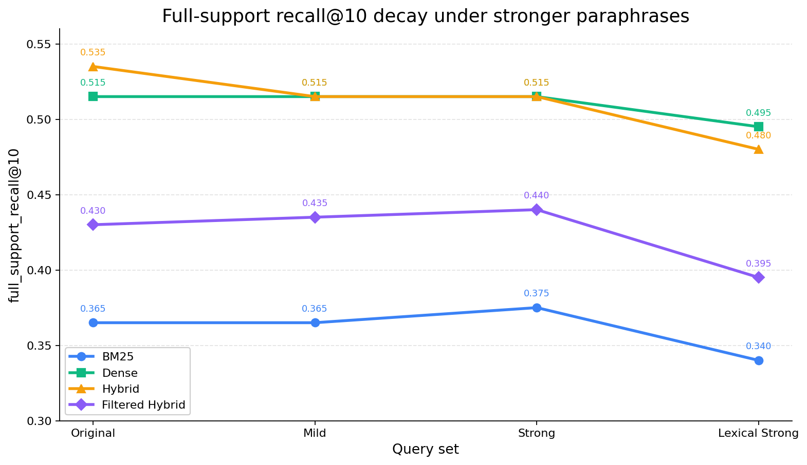
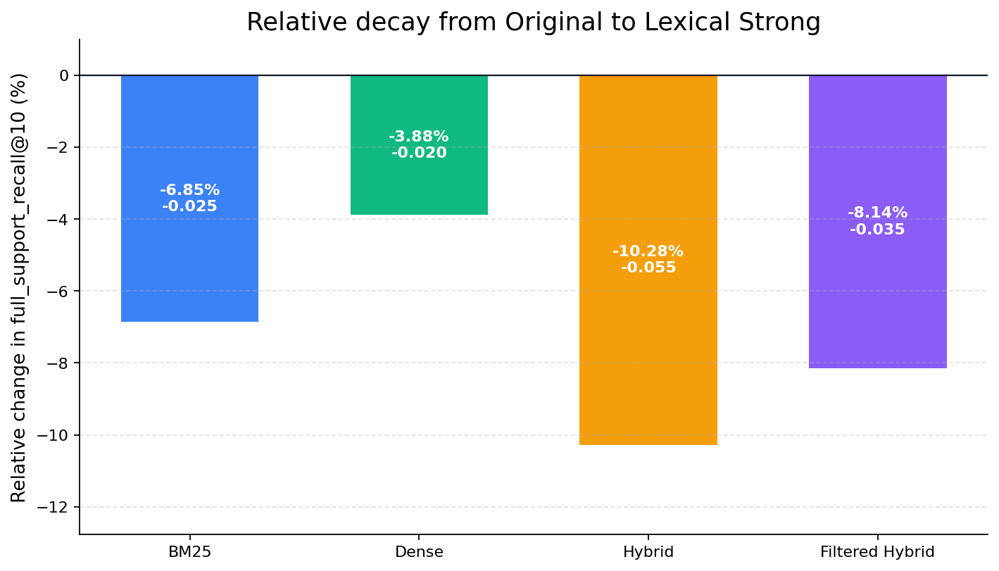

# Báo cáo paraphrase benchmark HotpotQA

Mục tiêu của task này là kiểm tra một việc đơn giản: nếu câu hỏi HotpotQA bị viết lại bằng paraphrase, các method retrieval của mình có còn retrieve đủ supporting documents không?

Metric chính là `full_support_recall@10`, vì HotpotQA là multi-hop QA. Một query chỉ được tính tốt khi top 10 retrieve đủ toàn bộ supporting documents.

## 1. Task này đã làm gì?

Pipeline cuối cùng đi từ generate paraphrase đến benchmark:

```text
200 câu hỏi HotpotQA gốc
  -> generate 3 mức paraphrase
  -> validate paraphrase local
  -> regenerate các câu còn thiếu hoặc chưa đạt
  -> audit độ đổi từ vựng
  -> benchmark 4 method retrieval
  -> viết report so sánh metric
```

Ba mức paraphrase được dùng:

| Set | Ý nghĩa |
| --- | --- |
| `mild_200` | Viết lại nhẹ, câu tự nhiên hơn, gần câu gốc. |
| `strong_200` | Đổi cấu trúc/reorder rõ hơn, nhưng vẫn còn nhiều keyword giống gốc. |
| `lexical_strong_200` | Nấc mạnh nhất, bắt buộc đổi content words không phải entity để stress BM25/lexical retrieval. |

Mỗi set có đúng 200 câu và giữ `source_query_id`, nên qrels/supporting documents vẫn map về query gốc.

## 2. Tạo và validate paraphrase

Notebook generation đã được đơn giản hóa để chạy tuần tự, tránh lỗi Kaggle/local:

```text
load 200 source queries
-> generate natural_mild
-> write checkpoint/artifact
-> generate natural_strong
-> write checkpoint/artifact
-> generate lexical_strong
-> write checkpoint/artifact
```

Notebook dùng OpenAI-compatible API và đọc `.env`, nên có thể chạy với OpenAI thật hoặc local router:

```text
OPENAI_API_KEY
OPENAI_BASE_URL
OPENAI_MODEL
```

Mình không đưa output LLM thẳng vào benchmark. Validator loại các câu không dùng được, ví dụ:

| Nhóm lỗi | Vì sao phải loại? |
| --- | --- |
| Câu rỗng hoặc giống hệt câu gốc | Không đo được paraphrase robustness. |
| Duplicate trong cùng source/profile | Không tăng dữ liệu thật. |
| Mất hoặc đổi entity chính | Qrels gốc có thể không còn đúng. |
| Mất hoặc đổi số/năm | Câu hỏi có thể đổi nghĩa. |
| `lexical_strong` đổi từ chưa đủ | Không đủ mạnh để stress lexical retrieval. |

Kết quả validation cuối:

| Chỉ số | Giá trị |
| --- | ---: |
| Candidate final sau merge/regenerate | 668 |
| Candidate hợp lệ | 603 |
| Candidate được chọn vào benchmark | 600 |
| `natural_mild` selected | 200 |
| `natural_strong` selected | 200 |
| `lexical_strong` selected | 200 |
| Missing sau regeneration | 0 |

Với `lexical_strong`, có một vài câu rất khó nên phải rescue thủ công sau nhiều vòng regenerate, nhưng vẫn đi qua cùng validator. Không có câu nào được đưa vào benchmark bằng cách hạ ngưỡng.

## 3. Paraphrase có đủ mạnh không?

Ban đầu bạn nhận xét đúng: `mild` và `strong` vẫn còn nhẹ, nhiều câu chỉ đổi trật tự hoặc đổi từ hỏi. Vì vậy mình thêm lexical audit để đo mức đổi từ vựng thật sự.

Ba chỉ số chính:

| Metric | Ý nghĩa |
| --- | --- |
| `content_change_ratio` | Tỷ lệ content terms mới so với câu gốc. Cao hơn nghĩa là đổi nhiều hơn. |
| `content_jaccard` | Mức overlap content terms giữa câu gốc và paraphrase. Thấp hơn nghĩa là ít trùng keyword hơn. |
| `no_new_content_terms` | Số câu không thêm content term mới. Với stress test, chỉ số này nên gần 0. |

Kết quả audit:

| Set | Median content-change | Mean content Jaccard | No new content terms | Đọc nhanh |
| --- | ---: | ---: | ---: | --- |
| `mild_200` | 0.0976 | 0.8041 | 89/200 | Còn gần câu gốc, nhiều câu chưa thêm content term mới. |
| `strong_200` | 0.2727 | 0.6114 | 23/200 | Đổi rõ hơn mild, nhưng vẫn chưa phải lexical stress test chính. |
| `lexical_strong_200` | 0.5000 | 0.3407 | 0/200 | Đủ mạnh để stress lexical retrieval. |

Ví dụ vì sao `mild/strong` còn nhẹ:

| Profile | Original | Paraphrase | Nhận xét |
| --- | --- | --- | --- |
| `natural_mild` | Daniel Márcio Fernandes plays for a club founded in which year ? | Daniel Márcio Fernandes plays for a club that was founded in which year? | Chỉ thêm `that was`, content terms gần như không đổi. |
| `natural_strong` | What company produced the show on which Cliff Clavin was a character? | Cliff Clavin was a character on the show that was produced by what company? | Reorder/passive, vẫn giữ keyword chính. |

Ví dụ `lexical_strong` đạt yêu cầu mạnh hơn:

| Original | Lexical strong | Khác ở đâu |
| --- | --- | --- |
| Daniel Márcio Fernandes plays for a club founded in which year ? | Daniel Márcio Fernandes is a player for a team established in which year? | `club` -> `team`, `founded` -> `established`. |
| The player voted SEC Player of the Year in 1990 played college football at what university? | At which university did the athlete named SEC Player of the Year in 1990 play college football? | `player` -> `athlete`, `voted` -> `named`. |
| Cliff Clavin was a character on the show that was produced by what company? | Cliff Clavin was a role on the television series made by what company? | `character` -> `role`, `show` -> `television series`, `produced` -> `made`. |
| Which documentary film was produced first, A Diary for Timothy or The Age of Stupid? | Which nonfiction movie was made earlier, A Diary for Timothy or The Age of Stupid? | `documentary film` -> `nonfiction movie`, `produced first` -> `made earlier`. |

Kết luận phần này: `mild` và `strong` hợp lệ về nghĩa/qrels, nhưng chưa đủ để chứng minh robustness với đổi từ khóa mạnh. `lexical_strong` mới là stress set chính.

## 4. Benchmark setup

Benchmark chạy trên full-corpus HotpotQA stack.

| Thành phần | Giá trị |
| --- | --- |
| Dataset | `beir/hotpotqa/dev` |
| Query sets | `original_200`, `mild_200`, `strong_200`, `lexical_strong_200` |
| Top-k | 10 |
| Candidate-k | 50 |
| RRF-k | 30 |
| Output | `evaluation/results/hotpotqa_full/paraphrase_final/summary.json` |

Methods được benchmark:

| Method | Vai trò |
| --- | --- |
| `es_bm25` | Lexical baseline. |
| `tv_dense` | Dense semantic retrieval thuần. |
| `tv_hybrid` | BM25 + TurboVec dense bằng RRF. |
| `tv_filtered_hybrid` | BM25-filtered hybrid, nhanh hơn nhưng chất lượng thấp hơn. |

## 5. Kết quả chính

Bảng dưới là `full_support_recall@10`, metric quan trọng nhất của task này.



Biểu đồ này là phần quan trọng nhất của experiment. `mild` và `strong` gần như không tạo decay rõ. Đến `lexical_strong`, cả 4 method mới tụt, nghĩa là bộ paraphrase lúc đó mới thật sự gây áp lực đổi từ khóa.

| Method | Original | Mild | Strong | Lexical Strong |
| --- | ---: | ---: | ---: | ---: |
| `es_bm25` | 0.365 | 0.365 | 0.375 | 0.340 |
| `tv_dense` | 0.515 | 0.515 | 0.515 | 0.495 |
| `tv_hybrid` | 0.535 | 0.515 | 0.515 | 0.480 |
| `tv_filtered_hybrid` | 0.430 | 0.435 | 0.440 | 0.395 |

Delta từ original sang các mức paraphrase:

| Method | Δ Mild | Δ Strong | Δ Lexical Strong |
| --- | ---: | ---: | ---: |
| `es_bm25` | +0.000 | +0.010 | -0.025 |
| `tv_dense` | +0.000 | +0.000 | -0.020 |
| `tv_hybrid` | -0.020 | -0.020 | -0.055 |
| `tv_filtered_hybrid` | +0.005 | +0.010 | -0.035 |

Nhìn riêng từ `original` sang `lexical_strong`, decay tương đối như sau:



| Method | Original | Lexical Strong | Absolute Δ | Relative Δ |
| --- | ---: | ---: | ---: | ---: |
| `es_bm25` | 0.365 | 0.340 | -0.025 | -6.85% |
| `tv_dense` | 0.515 | 0.495 | -0.020 | -3.88% |
| `tv_hybrid` | 0.535 | 0.480 | -0.055 | -10.28% |
| `tv_filtered_hybrid` | 0.430 | 0.395 | -0.035 | -8.14% |

Cách đọc đơn giản:

- `mild` và `strong` chưa làm BM25 giảm rõ vì vẫn giữ nhiều lexical anchors.
- `lexical_strong` làm tất cả method giảm, đúng với kỳ vọng khi từ khóa bị thay mạnh.
- `tv_dense` giảm ít nhất ở lexical strong: `-0.020` full-support@10.
- `tv_hybrid` tốt nhất trên original, nhưng giảm mạnh nhất ở lexical strong: `-0.055` full-support@10.

## 6. Metric đầy đủ hơn

Ngoài full-support, benchmark còn đo `recall@10`, `mrr@10`, và `ndcg@10`.

| Set | Method | Recall@10 | MRR@10 | nDCG@10 | full_support@10 |
| --- | --- | ---: | ---: | ---: | ---: |
| original_200 | `es_bm25` | 0.6025 | 0.7108 | 0.5727 | 0.365 |
| original_200 | `tv_dense` | 0.7225 | 0.8472 | 0.7082 | 0.515 |
| original_200 | `tv_hybrid` | 0.7400 | 0.8608 | 0.7214 | 0.535 |
| original_200 | `tv_filtered_hybrid` | 0.6650 | 0.8059 | 0.6585 | 0.430 |
| mild_200 | `es_bm25` | 0.6050 | 0.7235 | 0.5810 | 0.365 |
| mild_200 | `tv_dense` | 0.7250 | 0.8461 | 0.7077 | 0.515 |
| mild_200 | `tv_hybrid` | 0.7375 | 0.8607 | 0.7185 | 0.515 |
| mild_200 | `tv_filtered_hybrid` | 0.6650 | 0.8134 | 0.6610 | 0.435 |
| strong_200 | `es_bm25` | 0.6125 | 0.7242 | 0.5841 | 0.375 |
| strong_200 | `tv_dense` | 0.7275 | 0.8204 | 0.6964 | 0.515 |
| strong_200 | `tv_hybrid` | 0.7325 | 0.8603 | 0.7177 | 0.515 |
| strong_200 | `tv_filtered_hybrid` | 0.6625 | 0.8143 | 0.6650 | 0.440 |
| lexical_strong_200 | `es_bm25` | 0.5875 | 0.6968 | 0.5589 | 0.340 |
| lexical_strong_200 | `tv_dense` | 0.7150 | 0.8125 | 0.6809 | 0.495 |
| lexical_strong_200 | `tv_hybrid` | 0.7050 | 0.8435 | 0.6953 | 0.480 |
| lexical_strong_200 | `tv_filtered_hybrid` | 0.6375 | 0.7992 | 0.6395 | 0.395 |

## 7. Nhận xét theo method

`es_bm25`: Không giảm ở `mild` và `strong`, thậm chí `strong` tăng nhẹ. Điều này không có nghĩa BM25 robust với paraphrase mạnh. Lý do là hai set này vẫn giữ nhiều keyword. Sang `lexical_strong`, BM25 giảm `-0.025` full-support@10.

`tv_dense`: Ổn định nhất khi đổi từ vựng mạnh. Ở `lexical_strong`, full-support chỉ giảm `-0.020`. Đây là semantic robustness baseline tốt nhất trong benchmark này.

`tv_hybrid`: Chất lượng cao nhất trên câu gốc (`0.535` full-support@10), nhưng giảm mạnh nhất ở `lexical_strong` (`-0.055`). Điều này cho thấy hybrid đang hưởng lợi từ BM25 ở query gốc, nhưng cũng bị phần lexical kéo xuống khi overlap giảm.

`tv_filtered_hybrid`: Nhanh hơn `tv_hybrid`, nhưng chất lượng thấp hơn. Nó cũng giảm ở `lexical_strong`, nên chưa đủ mạnh để thay default.

## 8. Latency

Latency local có dao động do cache, embedding model, IO và full-corpus search. Không nên đọc bảng này như SLA, nhưng vẫn hữu ích để so sánh tương đối.

| Set | Method | p50 ms | p95 ms | QPS |
| --- | --- | ---: | ---: | ---: |
| original_200 | `es_bm25` | 118.4426 | 372.4396 | 5.9677 |
| original_200 | `tv_dense` | 452.9045 | 780.1044 | 1.4251 |
| original_200 | `tv_hybrid` | 1158.6493 | 4053.9824 | 0.5930 |
| original_200 | `tv_filtered_hybrid` | 328.9298 | 1259.3712 | 2.1359 |
| lexical_strong_200 | `es_bm25` | 104.9877 | 555.7445 | 6.0279 |
| lexical_strong_200 | `tv_dense` | 466.8851 | 745.2094 | 1.2171 |
| lexical_strong_200 | `tv_hybrid` | 642.7130 | 2187.2581 | 1.1000 |
| lexical_strong_200 | `tv_filtered_hybrid` | 197.9273 | 714.6010 | 3.5409 |

Pattern chính: `tv_hybrid` đắt nhất, `es_bm25` nhanh nhất, `tv_filtered_hybrid` thường nhanh hơn `tv_hybrid` nhưng chất lượng thấp hơn.

## 9. Two-hop / BEAM-ish có đưa vào không?

Không đưa vào main paraphrase benchmark.

Repo có method experimental `tv_two_hop_bridge_rrf` từ story `US-S4-009`, nhưng nó thuộc task cải tiến retrieval riêng. Pilot trước đó không thắng `tv_hybrid` và latency cao hơn, nên report này chỉ tập trung vào 4 method chính.

Nếu cần đánh giá riêng, nên chạy phụ lục cho `tv_two_hop_bridge_rrf` trên cả 4 set: `original_200`, `mild_200`, `strong_200`, `lexical_strong_200`.

## 10. Kết luận

Task paraphrase benchmark đã hoàn tất end-to-end:

```text
generate paraphrase
-> validate
-> regenerate đủ 200/profile
-> lexical audit
-> benchmark 4 methods
-> report kết quả
```

Kết luận chính:

1. `mild` và `strong` hợp lệ nhưng còn nhẹ, chủ yếu test rewrite cú pháp/reordering.
2. `lexical_strong` mới là stress test đúng cho đổi từ khóa mạnh.
3. BM25 chỉ ổn khi paraphrase vẫn giữ keyword; sang `lexical_strong` thì giảm.
4. `tv_dense` ổn định nhất khi đổi từ vựng mạnh.
5. `tv_hybrid` tốt nhất trên original nhưng nhạy nhất với lexical paraphrase mạnh.
6. Giữ `tv_hybrid` làm default demo vẫn hợp lý cho query gần tự nhiên/original, nhưng cần ghi rõ robustness gap.

Điểm không nên claim: đây là pilot 200-query project-progress trên `beir/hotpotqa/dev`, không phải benchmark paper-comparable hoặc leaderboard claim.

## 11. Artifacts

Query sets cuối:

```text
artifacts/hotpotqa_full/paraphrase/validated/original_200.tsv
artifacts/hotpotqa_full/paraphrase/validated/mild_200.tsv
artifacts/hotpotqa_full/paraphrase/validated/strong_200.tsv
artifacts/hotpotqa_full/paraphrase/validated/lexical_strong_200.tsv
```

Validation/audit:

```text
artifacts/hotpotqa_full/paraphrase/validated/summary.json
artifacts/hotpotqa_full/paraphrase/validated/accepted.tsv
artifacts/hotpotqa_full/paraphrase/validated/rejected.tsv
artifacts/hotpotqa_full/paraphrase/validated/lexical_diversity_summary.json
artifacts/hotpotqa_full/paraphrase/validated/lexical_diversity_examples.tsv
```

Benchmark outputs:

```text
evaluation/results/hotpotqa_full/paraphrase_final/original_200.json
evaluation/results/hotpotqa_full/paraphrase_final/mild_200.json
evaluation/results/hotpotqa_full/paraphrase_final/strong_200.json
evaluation/results/hotpotqa_full/paraphrase_final/lexical_strong_200.json
evaluation/results/hotpotqa_full/paraphrase_final/summary.json
```

Report charts:

```text
docs/sprint4/assets/paraphrase_full_support_decay.png
docs/sprint4/assets/paraphrase_relative_decay.png
docs/sprint4/assets/paraphrase_full_support_decay.svg
docs/sprint4/assets/paraphrase_relative_decay.svg
```

Harness stories:

- `US-S4-003`: validator và regeneration hoàn tất 200/200.
- `US-S4-004`: final 200-query benchmark hoàn tất trên 4 methods, gồm `lexical_strong_200`.
- `US-S4-010`: lexical-strong profile hoàn tất 200/200 với lexical gates.
