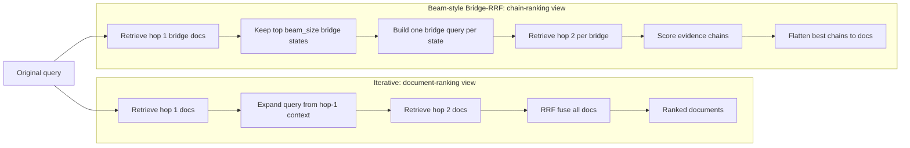
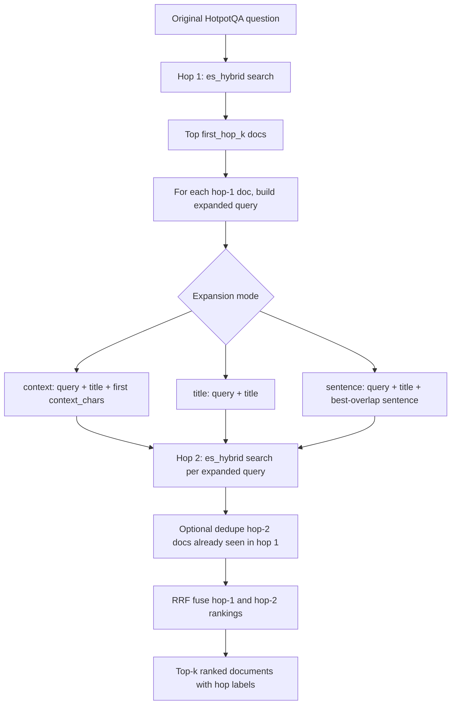
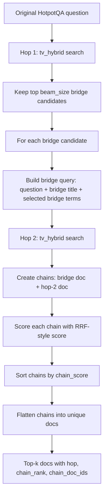

# Multi-Hop Retrieval Methods Implemented

## Scope

File này mô tả lại hai hướng multi-hop retrieval đã được implement trong repo:

1. `es_iterative_hybrid`: iterative two-hop query expansion trên Elasticsearch
   hybrid path.
2. `tv_two_hop_bridge_rrf`: beam-style two-hop Bridge-RRF trên TurboVec hybrid
   path.

Hai method này không cùng trạng thái runtime:

- `es_iterative_hybrid` là legacy/Sprint 1 method, đã benchmark trên
  `nano-beir/hotpotqa` và vẫn còn code trong `ElasticsearchRetriever`, nhưng
  không còn expose trong dashboard full-corpus runtime vì active full index là
  BM25-only, không có dense vector field cho ES hybrid.
- `tv_two_hop_bridge_rrf` là Sprint 4 benchmark-only method, chạy trên full
  HotpotQA bằng `tv_hybrid` hop 1 + bridge-query hop 2, có chain metadata và
  chain metrics, nhưng chưa được chọn làm default vì không vượt `tv_hybrid`.

## Tại Sao Cần Multi-Hop Retrieval?

HotpotQA thường cần retrieve đủ nhiều support documents cho cùng một câu hỏi.
Một one-shot query có thể tìm được hop dễ, nhưng thiếu hop bridge/answer nếu
document thứ hai không overlap lexical trực tiếp với câu hỏi.

Vì vậy repo có hai hướng thử nghiệm:

```text
Iterative expansion:
question -> retrieve hop 1 -> expand query bằng evidence hop 1 -> retrieve hop 2 -> fuse docs

Beam-style Bridge-RRF:
question -> retrieve nhiều bridge candidates -> tạo query riêng cho từng bridge -> retrieve hop 2 -> rank chains -> flatten docs
```

## Ý Tưởng Khác Nhau Ở Đâu?

Ở tầng cao, hai method trông giống nhau vì đều là two-hop retrieval:

```text
query
  -> retrieve hop 1
  -> dùng hop 1 để tạo query mới
  -> retrieve hop 2
  -> gom kết quả
```

Khác biệt cốt lõi không nằm ở việc có hop 1/hop 2 hay không, mà nằm ở **đơn
vị được rank**.

### Iterative: Rank Documents

`es_iterative_hybrid` dùng first-hop documents như nguồn context để mở rộng
query. Sau đó nó gom tất cả documents từ hop 1 và hop 2 rồi RRF fuse ở mức
document.

```text
query
  -> hop1 docs: A, B, C, D, E
  -> expand query from A -> hop2 docs
  -> expand query from B -> hop2 docs
  -> expand query from C -> hop2 docs
  -> fuse all documents
  -> output ranked docs
```

Nó không cố giữ cặp evidence `(A -> X)` như một path hoàn chỉnh. Chain chỉ là
quá trình trung gian để tạo thêm candidates. Output cuối cùng là ranked
documents.

Tóm lại:

```text
Iterative = retrieve more documents by expanding the query from first-hop evidence.
```

### Beam-Style Bridge-RRF: Rank Chains

`tv_two_hop_bridge_rrf` coi mỗi first-hop document là một bridge candidate. Nó
giữ một beam nhỏ các bridge docs tốt nhất, tạo hop-2 query riêng cho từng
bridge, rồi tạo các evidence chains.

```text
query
  -> hop1 bridge candidates: A, B, C
  -> keep beam: A, B

  A -> bridge query A -> hop2 docs X, Y, Z
       chains: (A, X), (A, Y), (A, Z)

  B -> bridge query B -> hop2 docs M, N, O
       chains: (B, M), (B, N), (B, O)

  -> score chains
  -> sort chains
  -> flatten best chain docs into final ranked docs
```

Nó rank chain trước, document sau. Vì vậy output có thể mang thêm chain
metadata:

```text
chain_rank
chain_doc_ids = [hop1_doc_id, hop2_doc_id]
hop = 1 hoặc 2
```

Tóm lại:

```text
Beam-style Bridge-RRF = search over possible evidence chains, then flatten the best chains.
```

### Ví Dụ Trực Giác

Với một HotpotQA bridge question, ta có thể cần hai support docs:

```text
Doc A: player X plays for Club Y
Doc B: Club Y is based in Country Z
```

Iterative retrieval sẽ:

```text
tìm A/B/C -> dùng A/B/C để expand query -> gom toàn bộ docs -> rank docs riêng lẻ
```

Beam-style retrieval sẽ:

```text
A là bridge candidate -> A dẫn tới B -> score chain (A, B) -> flatten A và B vào output
```

Do đó Bridge-RRF có diagnostic value tốt hơn: nếu nó hoạt động, ta không chỉ
biết doc nào xuất hiện, mà còn biết doc đó đến từ chain nào.

### So Sánh Ngắn

| Khía cạnh | Iterative | Beam-style / Bridge-RRF |
| --- | --- | --- |
| Skeleton | two-hop query expansion | two-hop query expansion |
| Đơn vị rank chính | document | chain trước, document sau |
| Vai trò hop-1 docs | context để expand query | bridge states/candidates |
| Có giữ path evidence? | yếu, chỉ có hop label | có `chain_doc_ids` và `chain_rank` |
| Output phù hợp cho | document ranking/debug hop | evidence-chain diagnostics |
| Rủi ro chính | query drift từ context sai | bridge sai thì cả chain sai |

Ý tưởng nghiên cứu của repo là thử hai mức multi-hop awareness:

```text
Level 1: Iterative document retrieval
Dùng hop 1 để kéo thêm tài liệu ở hop 2.

Level 2: Chain-aware retrieval
Không chỉ kéo thêm tài liệu, mà thử hình thành cặp evidence A -> B.
```

Benchmark hiện tại cho thấy chain-aware idea có giá trị phân tích, nhưng
implementation còn heuristic quá đơn giản nên chưa vượt one-shot `tv_hybrid`.

### Flowchart So Sánh Ý Tưởng



Điểm đọc chart:

- Iterative gom tất cả candidates rồi rank documents.
- Bridge-RRF giữ các branch hop 1 như bridge states, rank chains trước, rồi mới
  flatten về documents.

## Method 1: `es_iterative_hybrid`

### Implementation Location

```text
src/retrieval/elasticsearch_retriever.py
ElasticsearchRetriever.search_iterative_hybrid(...)
```

Benchmark dispatcher:

```text
src/evaluation/benchmark_es.py
METHOD_MAP["es_iterative_hybrid"] = "iterative_hybrid"
```

### Algorithm

`es_iterative_hybrid` chạy một two-hop loop đơn giản:

```text
input question
  -> Hop 1: search(query, "hybrid", first_hop_k)
  -> for each hop-1 hit:
       expanded_query = original question + selected context from hop-1 doc
       hop2_hits = search(expanded_query, "hybrid", second_hop_k)
  -> optionally remove hop-2 duplicates already seen in hop 1
  -> RRF fuse all hop rankings
  -> return top-k docs with hop labels
```

Trong code:

- Hop 1 gọi `self.search(query, "hybrid", first_hop_k, ...)`.
- Hop 2 gọi `self.search(expanded_query, "hybrid", second_hop_k, ...)` cho
  từng first-hop document.
- `fuse_rrf(rankings, top_k, rrf_k)` gom hop 1 và toàn bộ hop 2.
- Result được gắn:

```text
hit["hop"] = 1 hoặc 2
hit["source"] = iterative_<source>
```

Mermaid flow:



Trong chart này, `H2` được gọi nhiều lần: một lần cho mỗi first-hop document
được dùng để expand query. Output cuối không giữ chain pair rõ ràng, chỉ giữ
ranked documents và `hop` label.

### Query Expansion Modes

Helper `_expand_query(...)` support nhiều mode:

| Mode | Expanded query |
| --- | --- |
| `context` | `original query + title + first context_chars chars of text` |
| `title` | `original query + title` |
| `sentence` | `original query + title + selected sentence` |

`sentence` mode chọn sentence có overlap token cao nhất với original query.

Benchmark dispatcher còn map thêm các biến thể:

```text
es_iterative_hybrid   -> expansion_mode=context
es_iterative_title    -> expansion_mode=title
es_iterative_sentence -> expansion_mode=sentence
es_iterative_fast     -> expansion_mode=title, giảm candidate_k/num_candidates
```

### Hyperparameters

Các tham số chính:

```text
first_hop_k      default 5
second_hop_k     default 10
context_chars    default 256
candidate_k      default 100 trong benchmark nano
rrf_k            default 30 trong benchmark nano command
dedupe_hop2      true trong các variant iterative dispatcher
```

Config default nằm ở:

```text
src/core/config.py
MULTIHOP_FIRST_HOP=5
MULTIHOP_SECOND_HOP=10
MULTIHOP_CONTEXT_CHARS=256
```

### Benchmark Evidence

Artifact:

```text
evaluation/results/es_nano_iterative.json
```

Benchmark command được lưu trong Sprint 1 docs:

```powershell
python -m src.evaluation.benchmark_es --dataset nano-beir/hotpotqa --index hotpotqa_nano_current --methods es_bm25,es_dense,es_hybrid,es_iterative_hybrid --top-k 10 --candidate-k 100 --num-candidates 100 --rrf-k 30 --first-hop-k 5 --second-hop-k 10 --context-chars 256 --output evaluation/results/es_nano_iterative.json --run-dir evaluation/runs/iterative
```

Nano HotpotQA result:

| Method | Recall@10 | MRR@10 | nDCG@10 | Full-support@10 | p50 ms | p95 ms | QPS |
| --- | ---: | ---: | ---: | ---: | ---: | ---: | ---: |
| `es_hybrid` | 0.910 | 0.9253 | 0.8631 | 0.820 | 142.0170 | 182.1056 | 6.8969 |
| `es_iterative_hybrid` | 0.900 | 0.9033 | 0.8341 | 0.820 | 1119.7100 | 1593.4272 | 0.8408 |

Interpretation:

- `es_iterative_hybrid` đưa explicit two-hop workflow vào repo.
- Nó giữ được `full_support_recall@10 = 0.82`, ngang `es_hybrid` trên nano.
- Nhưng latency cao hơn nhiều và quality tổng thể thấp hơn `es_hybrid`.
- Vì vậy method này phù hợp để debug evidence-chain behavior hơn là default
  retrieval method.

### Runtime Limitation

Các ES iterative method không được dùng trong active full HotpotQA runtime hiện
tại vì `hotpotqa_full_bm25_current` là BM25-only index. Nó không có field
`embedding` cần cho ES dense/hybrid path.

Nói cách khác:

```text
Code còn tồn tại: có
Benchmark nano đã có: có
Full-corpus dashboard expose: không
Lý do: active full ES index thiếu dense_vector field
```

## Method 2: `tv_two_hop_bridge_rrf`

### Implementation Location

```text
src/retrieval/turbovec_retriever.py
TurboVecHybridRetriever.search_two_hop_bridge_rrf(...)
TurboVecHybridRetriever._build_bridge_query(...)
```

Benchmark dispatcher:

```text
src/evaluation/benchmark_es.py
TURBOVEC_METHODS includes "tv_two_hop_bridge_rrf"
```

Story/report:

```text
docs/stories/epics/E04-sprint4-evaluation-expansion/US-S4-009-iterative-retrieval-improvement.md
docs/sprint4/retrieval-improvement-report.md
```

### Algorithm

`tv_two_hop_bridge_rrf` là beam-style retrieval ở mức candidate chain:

```text
input question
  -> Hop 1: tv_hybrid(query, hop1_top_k)
  -> keep top beam_size hop-1 docs as bridge candidates
  -> for each bridge doc:
       bridge_query = question + bridge title + selected bridge terms
       hop2_hits = tv_hybrid(bridge_query, hop2_top_k)
       create chains (bridge_doc, hop2_doc)
  -> score each chain with lightweight RRF-style chain score
  -> sort chains
  -> flatten chains into unique ranked documents
  -> return docs with chain metadata
```

Mermaid flow:



Chain scoring detail:

```mermaid
flowchart LR
    A[Bridge doc A, hop1_rank]
    X[Hop-2 doc X, hop2_rank]
    C[Chain A -> X]
    S[chain_score = 1/(rrf_k + hop1_rank) + 1/(rrf_k + hop2_rank)]
    M[Metadata: chain_doc_ids = A, X]

    A --> C
    X --> C
    C --> S --> M
```

Ở đây output có thể giải thích được đường evidence candidate nào sinh ra doc:

```text
chain_doc_ids = [bridge_doc_id, answer_doc_id]
chain_rank = vị trí của chain sau khi sort
```

### Bridge Query Construction

`_build_bridge_query(query, hit, max_bridge_terms)` tạo query hop 2 bằng:

```text
original question + first-hop title + selected terms from first-hop text
```

Term selection rule:

- tokenize bằng regex `[A-Za-z0-9]+`;
- bỏ token đã có trong original query;
- bỏ duplicate token;
- bỏ token ngắn hơn 3 ký tự;
- lấy tối đa `max_bridge_terms` token đầu tiên còn lại.

Ví dụ schematic:

```text
question = "Which campaign launched at Trump Tower?"
hop1 title = "Donald Trump presidential campaign"
hop1 text terms = "announced candidacy ... tower ..."

bridge_query = question + hop1 title + announced candidacy ...
```

### Chain Scoring And Flattening

Với mỗi pair `(hop1_hit, hop2_hit)`:

```text
chain_score = 1 / (rrf_k + hop1_rank) + 1 / (rrf_k + hop2_rank)
```

Sau đó:

1. sort candidate chains theo `chain_score` giảm dần;
2. duyệt từng chain;
3. append hop 1 và hop 2 docs vào output nếu chưa xuất hiện;
4. gắn metadata chain vào mỗi output doc:

```text
source = bridge_rrf
hop = 1 hoặc 2
chain_rank = rank của chain
chain_doc_ids = [hop1_doc_id, hop2_doc_id]
score = chain_score
```

Nếu không đủ docs từ chains, method fallback append các hop-1 hits còn lại.

### Hyperparameters

Các tham số chính:

```text
hop1_top_k / first_hop_k
hop2_top_k / second_hop_k
beam_size
max_bridge_terms
candidate_k
rrf_k
```

Sprint 4 pilot dùng:

```text
top_k = 10
candidate_k = 50
num_candidates = 50
rrf_k = 30
first_hop_k = 3
second_hop_k = 5
beam_size = 2
max_bridge_terms = 6
```

### Benchmark Evidence

Artifacts:

```text
evaluation/results/hotpotqa_full/bridge_rrf/bridge_rrf_smoke_50.json
evaluation/results/hotpotqa_full/bridge_rrf/bridge_rrf_pilot_200.json
evaluation/runs/hotpotqa_full/bridge_rrf/tv_hybrid_beir_hotpotqa_dev_top10.trec
evaluation/runs/hotpotqa_full/bridge_rrf/tv_two_hop_bridge_rrf_beir_hotpotqa_dev_top10.trec
```

50-query smoke result:

| Method | Full-support@2 | Full-support@5 | Full-support@10 | nDCG@10 | p95 ms | QPS | Chain recall@5 | Chain MRR |
| --- | ---: | ---: | ---: | ---: | ---: | ---: | ---: | ---: |
| `tv_hybrid` | 0.300 | 0.440 | 0.460 | 0.6659 | 4215.9710 | 0.3707 | n/a | n/a |
| `tv_two_hop_bridge_rrf` | 0.120 | 0.420 | 0.480 | 0.6260 | 3761.5026 | 0.3962 | 0.320 | 0.2083 |

200-query pilot result:

| Method | Full-support@2 | Full-support@5 | Full-support@10 | Recall@10 | MRR@10 | nDCG@10 | p95 ms | QPS | Chain recall@1 | Chain recall@5 | Chain MRR |
| --- | ---: | ---: | ---: | ---: | ---: | ---: | ---: | ---: | ---: | ---: | ---: |
| `tv_hybrid` | 0.330 | 0.475 | 0.535 | 0.740 | 0.8608 | 0.7214 | 2080.4528 | 0.8313 | n/a | n/a | n/a |
| `tv_two_hop_bridge_rrf` | 0.170 | 0.450 | 0.520 | 0.735 | 0.8468 | 0.6916 | 2832.7420 | 0.5281 | 0.170 | 0.390 | 0.2589 |

Interpretation:

- 50-query smoke có cải thiện nhẹ `full_support@10`: `0.480` vs `0.460`.
- 200-query pilot không vượt baseline: `0.520` vs `0.535` cho `tv_hybrid`.
- Latency vẫn trong guardrail khoảng `1.36x` p95 so với `tv_hybrid`, nhưng
  quality không đủ để đổi default.

### Status

`tv_two_hop_bridge_rrf` là benchmark-only method. Nó không phải dashboard
default và không được expose như interactive API method trong current runtime.
Mục tiêu chính là đánh giá evidence-chain retrieval và cung cấp chain metrics.

## So Sánh Hai Method

| Khía cạnh | `es_iterative_hybrid` | `tv_two_hop_bridge_rrf` |
| --- | --- | --- |
| Backend | Elasticsearch BM25 + dense_vector hybrid | TurboVec dense + ES BM25 hybrid |
| Runtime scope | Legacy nano benchmark; full runtime bị chặn do full ES index BM25-only | Full HotpotQA benchmark-only path |
| Hop 1 | `es_hybrid` | `tv_hybrid` |
| Hop 2 query | original query + title/context/sentence từ mỗi hop-1 doc | original query + bridge title + selected bridge terms |
| Search shape | iterative expansion, fuse all hop rankings | beam-style bridge candidates, rank chains, flatten docs |
| Chain metadata | hop labels | hop, chain_rank, chain_doc_ids |
| Metrics | standard retrieval + full_support@10 | standard retrieval + full_support@2/5/10 + chain_recall/MRR |
| Default status | not default | not default |

## How To Reproduce

### Legacy ES Iterative Nano Benchmark

```powershell
python -m src.evaluation.benchmark_es --dataset nano-beir/hotpotqa --index hotpotqa_nano_current --methods es_bm25,es_dense,es_hybrid,es_iterative_hybrid --top-k 10 --candidate-k 100 --num-candidates 100 --rrf-k 30 --first-hop-k 5 --second-hop-k 10 --context-chars 256 --output evaluation/results/es_nano_iterative.json --run-dir evaluation/runs/iterative
```

### Full HotpotQA Bridge-RRF Pilot

```powershell
python -m src.evaluation.benchmark_es --dataset beir/hotpotqa/dev --index hotpotqa_full_bm25_current --methods tv_hybrid,tv_two_hop_bridge_rrf --top-k 10 --max-queries 200 --candidate-k 50 --num-candidates 50 --rrf-k 30 --first-hop-k 3 --second-hop-k 5 --beam-size 2 --max-bridge-terms 6 --output evaluation/results/hotpotqa_full/bridge_rrf/bridge_rrf_pilot_200.json --run-dir evaluation/runs/hotpotqa_full/bridge_rrf
```

## Presentation Wording

Một cách trình bày trung thực:

```text
We implemented two explicit multi-hop retrieval baselines. The first is an
Elasticsearch iterative hybrid baseline that expands the second-hop query from
top first-hop evidence. The second is a TurboVec Bridge-RRF method that keeps a
small beam of bridge documents, generates hop-2 hybrid queries per bridge, ranks
document chains, and flattens them back into ranked evidence. Both are
heuristic baselines, not learned multi-hop retrievers. The current benchmarks
show useful diagnostic value but do not justify replacing tv_hybrid as the
default method.
```

## Limitations And Next Steps

- Cả hai method đều heuristic; không train MDR/Baleen/IRCoT-style model.
- Query expansion có rủi ro drift nếu hop-1 doc sai.
- `es_iterative_hybrid` cần full ES dense-vector index nếu muốn chạy lại trên
  full HotpotQA bằng Elasticsearch-only path.
- `tv_two_hop_bridge_rrf` cần tuning tốt hơn cho bridge term selection,
  entity extraction, dedupe, and chain scoring.
- Có thể cải thiện bằng:
  - entity-aware bridge query thay vì lấy token đầu tiên;
  - sentence selection tốt hơn;
  - reranker cho candidate chains;
  - adaptive beam size theo query difficulty;
  - expose chain debug view trong UI nếu cần demo evidence path.
